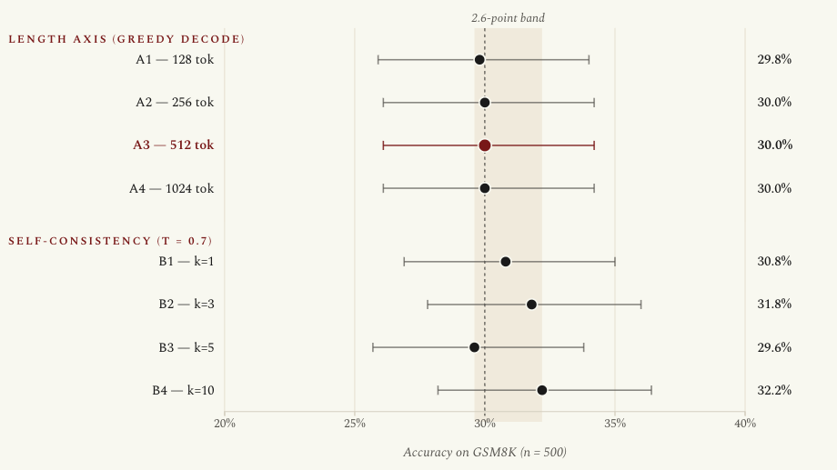
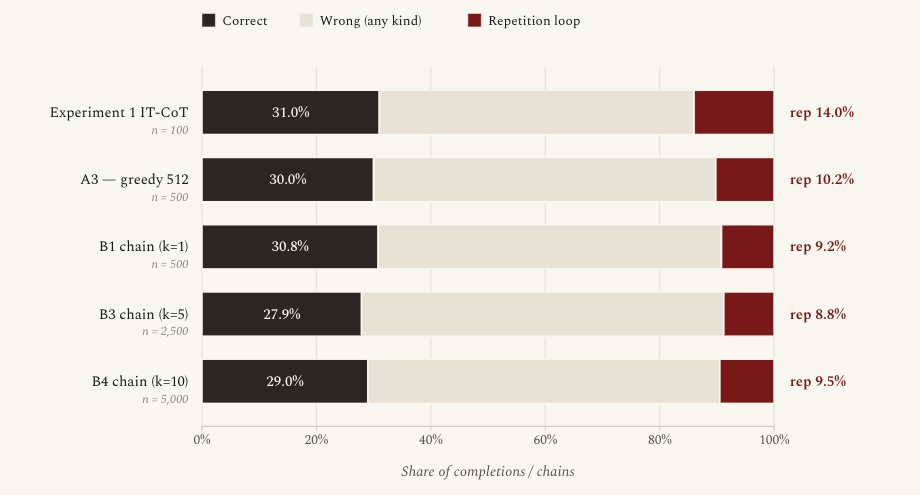
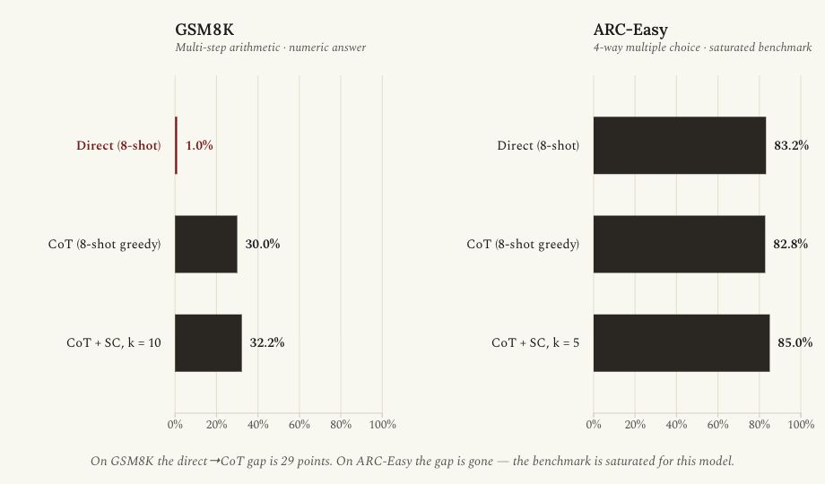
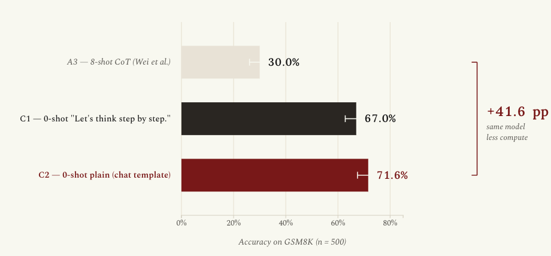

# Towards Local-First Mobile AI Assistance

## Part 2: When the Ceiling Is the Scaffolding — Stress-Testing Path 1's Plateau

**By Kasun Perera | April 29, 2026**

---

## Recap

Part 1 closed with a clean result. On the first 100 GSM8K test problems, instruction-tuned Gemma 4 E2B reached **31% accuracy** under 8-shot chain-of-thought, versus **1%** under matched 8-shot direct prompting. McNemar's exact test gave a p-value of 1.9 × 10⁻⁹ on a paired 30-0 discordance. The gate was open: chain-of-thought is doing real work on this model.

Path 1 — *trade more inference compute for more accuracy, no weight modification* — therefore had a baseline. The number to beat for any other path on the phone-class budget was 31%.

This post is about the next four experiments, which together asked whether 31% was actually a ceiling, and which gave a result I did not expect.

---

## The Frame for Part 2

Path 1 still has unspent levers inside the "more inference compute" envelope. Once chain-of-thought is on, you can pour compute into it in two obvious ways: let each chain run longer, or run more chains and vote. And the 31% finding itself was thin in three ways worth probing before I trust it as Path 1's representative number against the depth-recurrence retrofit, the quantized E4B sibling, and Mixture-of-Depths.

Five follow-up experiments, each pre-registered with thresholds before the data came back:

- **Experiment 2 — Length and self-consistency sweep on GSM8K.** Two independent axes. Generation lengths {128, 256, 512, 1024} at greedy. Self-consistency vote at k ∈ {1, 3, 5, 10} with temperature 0.7. n = 500 problems per cell.
- **Experiment 3 — Repetition-loop forensics.** Pure analysis on Experiments 1 and 2's existing JSONL outputs. Classify every completion and every sampled chain as `correct`, `terminated_wrong`, `repetition_loop`, or `truncated_no_answer`. Compute counterfactual accuracies if rep-loops were excluded.
- **Experiment 4 — ARC-Easy cross-benchmark validity.** Does the Path 1 plateau on GSM8K hold on a benchmark with no generation-length pressure and no failure-prone arithmetic? n = 500 ARC-Easy problems, three cells (CoT-greedy, CoT-self-consistency-k=5, direct).
- **Experiment 5 — Prompt-format probe.** Two zero-shot cells on GSM8K against the same 500 problems as Experiment 2: "Let's think step by step." and a plain question with no scaffolding at all, both via the IT model's chat template.
- **Experiment 9 — Extractor audit on the C2/A3 paired result.** A small follow-up triggered by Experiment 5's residual: 26 problems where A3 wins but C2 doesn't. Pure analysis on existing JSONL files, no new generations. Tests whether those 26 are reasoning failures or extractor mismatches.

Experiments 3 and 9 are CPU-only re-analyses on existing data. Experiments 2, 4, and 5 each took 1.5–8 hours of single-3090 time. Experiments 5 and 9 ended up being the decisive ones.

---

## Experiment 2: The Plateau Holds on Both Axes

### What was tested

Eight cells against the deterministic first 500 GSM8K problems, IT model only, same 8-shot Wei et al. exemplars from Experiment 1 (`exemplar_hash = a33e6d90c6844317`, byte-for-byte identical prompt builder). Length axis A was greedy decode at four caps. Sampling axis B was k chains at temperature 0.7, top-p 0.95, max 512 tokens, with majority-vote scoring on parsed integer answers.

A3 (greedy, 512 tokens) is Experiment 1's IT-CoT cell at n = 500. Its first 100 problems reproduce Experiment 1's exact completions as a regression check.

### Results

| Cell | Decode | Tokens | k | Accuracy (n=500) | Wilson 95% CI |
|---|---|---|---|---|---|
| A1 | greedy | 128  | 1  | 29.8% | (25.9, 34.0) |
| A2 | greedy | 256  | 1  | 30.0% | (26.1, 34.2) |
| A3 | greedy | 512  | 1  | 30.0% | (26.1, 34.2) |
| A4 | greedy | 1024 | 1  | 30.0% | (26.1, 34.2) |
| B1 | sampled | 512 | 1  | 30.8% | (26.9, 35.0) |
| B2 | sampled | 512 | 3  | 31.8% | (27.8, 36.0) |
| B3 | sampled | 512 | 5  | 29.6% | (25.7, 33.8) |
| B4 | sampled | 512 | 10 | 32.2% | (28.2, 36.4) |

Eight cells, a 2.6-point band, no Pareto frontier. Self-consistency at k = 10 buys 1.4 points over the greedy A3 reference at ten times the inference compute, and that lift fails paired-McNemar significance. The length sweep is flat to within a single problem from 256 tokens onward.

### Interpretation

The compute-versus-accuracy curve I expected — a knee somewhere along generation length, a kick from self-consistency voting — simply isn't there for this model on this benchmark under this prompt. Inside the 8-shot Wei et al. format, Path 1's compute budget is spent. More tokens don't help. More chains don't help.

This is itself a useful datum for the four-paths head-to-head: Path 1's representative is A3 at 512 tokens, 30.0% on GSM8K, and the depth-recurrence and quantized-E4B paths are not competing against a curve, just a number.

But "30% is the ceiling" is a load-bearing claim. The next three experiments tested it from three different directions.

---

## Experiment 3: Repetition Loops Are Real but Not Decisive

### What was tested

Pure re-analysis of every JSONL from Experiments 1 and 2 — 100 + 100 + 4 × 500 + (1 + 3 + 5 + 10) × 500 = 9,700 completions and chains. Each one classified by the canonical regex `(.{10,60})\1{2,}` (a 10-to-60-character span repeated three or more times immediately). False-positive rate was bounded by manual inspection of a 30-completion sample (2/30 borderline, 28/30 definite true positives).

### Results

Repetition rates by cell:

| Cell | n | Rep-loop count | Rep-loop rate |
|---|---|---|---|
| Experiment 1 IT-CoT (n=100) | 100 | 14 | 14.0% |
| Experiment 1 base-CoT (n=100) | 100 | 3 | 3.0% |
| A1 / A2 / A3 / A4 | 500 each | ~51 each | 10.2–10.4% |
| B1 chain | 500 | 46 | 9.2% |
| B2 chain | 1,500 | 145 | 9.7% |
| B3 chain | 2,500 | 220 | 8.8% |
| B4 chain | 5,000 | 475 | 9.5% |

Length-dependence: flat. Cap = 1024 tokens has the same rate as cap = 128. Sampling-dependence: chains rep-loop slightly *less* than greedy A3 (8.8–9.7% versus 10.2%), so sampling is escaping a small fraction of the attractors greedy gets stuck in, but not a meaningful fraction.

Counterfactual adjusted accuracies on A3:

- **Headline:** 30.0% (150 / 500)
- **Lenient** (drop rep-loops from denominator): 33.4%
- **Upper-bound** (impute A3-correct rate on rep-loop problems): 30.0%

The lenient number opens up by ~3 points. The upper-bound is unchanged because the rep-loop problems are problems A3 also gets wrong on the rare runs where it terminates — the reasoning failure and the rep-loop failure overlap heavily.

### Vote-on-repetition

For the axis-B cells, I broke the voted-wrong outcomes into four buckets: all chains rep-looped (vote on garbage), majority rep-looped but a minority got it right (voting hurt), minority rep-looped but the majority terminated wrong anyway (rep-loops were not decisive), or no rep-loops at all (the model just got it wrong). At k = 10, of 339 voted-wrong problems:

- 4 unanimous rep-loop
- 5 rep-loop plurality wrong
- 106 rep-loop unlucky
- 202 no rep-loops at all

Sixty percent of voting failures have nothing to do with stability. Five problems out of 500 are cases where voting actively hurt. This is a real but small effect.

A handful of problems are sticky — the same handful of GSM8K indices (49, 88, 174, 186, 246, 249, 353, 363, 384) trigger rep-loops in 8–10 of the 10 cells covering them. Idx 49 ("Richard lives in an apartment building with 15 floors...") rep-looped in every single cell, including all of Experiment 1.

### Interpretation

The 30% ceiling is not 30% because 10% of completions derail into garbage. It's 30% because the model gets the answer wrong on the same problems whether it terminates politely or not. Path 1's stability tax is real but bounded at about 3 percentage points. That's a small budget for any other path to recover by improving generation stability, and it's not the story.

---

## Experiment 4: ARC-Easy Is Saturated

### What was tested

500 ARC-Easy problems, three cells: 8-shot CoT greedy (`A3_arc`), 8-shot CoT self-consistency at k = 5 (`B3_arc`), and 8-shot direct with `max_new_tokens = 16` (`direct_arc`). Same model, same pinned dependencies as Experiment 2. Eight ARC-Easy train-split exemplars with handcrafted CoT rationales, hash pinned in the manifest.

### Results

| Cell | Accuracy | Mean gen tokens | Wall-clock per problem |
|---|---|---|---|
| A3_arc (CoT, greedy) | 82.8% | 488 | 3.15s |
| B3_arc (CoT, k=5) | 85.0% | n/a (5 chains) | ~15s effective |
| direct_arc (8-shot direct) | 83.2% | 11 | 0.11s |

### Interpretation

Two findings, both interesting and both partially-defusing.

First, the plateau pattern *does* generalize: B3_arc beats A3_arc by 2.2 points, well inside the same noise band Experiment 2 saw on GSM8K. Path 1's "more compute doesn't help" claim survives the cross-benchmark check.

Second, **direct prompting matches CoT on ARC-Easy.** 83.2% direct versus 82.8% CoT-greedy. On GSM8K, direct was 1% and CoT was 31%; on ARC-Easy, the gap is gone. The reason is mundane and important: ARC-Easy is a 4-way multiple-choice benchmark with strong 8-shot priming, and a strong instruction-tuned 2B model is already near the saturation point of "read the question, pick the right letter." There is no room for chain-of-thought to add anything.

This is a soft warning for the four-paths head-to-head: ARC-Easy will not differentiate the legs much. Whatever they are, they are all going to be in the high 80s on this benchmark. Whatever signal we get on test-time compute scaling has to come from the GSM8K side, where Path 1's putative ceiling is the bar. So the question of *what that ceiling really is* matters even more.

---

## Experiment 5: The Inversion

This is the one that changed Part 1's conclusions.

### What was tested

Two new cells against the same 500 GSM8K problems Experiment 2 used. Both via the IT model's chat template (`tokenizer.apply_chat_template`), greedy, 512 tokens, `temperature = 0`. Reference cell A3 from Experiment 2 was re-used by file path, not regenerated.

| Cell | User message |
|---|---|
| C1 — zero-shot simple | `{question}\n\nLet's think step by step.` |
| C2 — zero-shot plain | `{question}` |

Experiment 1 deliberately scoped zero-shot prompts out. The motivation here was a single asymmetry I had been ignoring: every Experiment-2 cell used the same eight Wei et al. exemplars from 2022, predating instruction-tuning ubiquity. For an IT model, those exemplars might be *anchoring* the model to the exemplars' style and arithmetic patterns instead of unlocking its reasoning.

### Results

| Cell | Accuracy | 95% CI | Hash hit | Mean gen tokens | Mean prompt tokens |
|---|---|---|---|---|---|
| A3 (8-shot CoT, ref) | 30.0% | (26.1, 34.2) | 81.2% | 403 | 747 |
| C1 (0-shot "step by step") | **67.0%** | (62.8, 71.0) | 0.0% | 328 | 78 |
| C2 (0-shot plain) | **71.6%** | (67.5, 75.4) | 0.0% | 276 | 69 |

Paired McNemar tests against A3:

| Comparison | only_X | only_A3 | both | p-value |
|---|---|---|---|---|
| C1 vs A3 | 217 | 32 | 118 | 5.85 × 10⁻³⁵ |
| C2 vs A3 | 234 | 26 | 124 | 5.08 × 10⁻⁴³ |
| C1 vs C2 | 11 | 34 | 324 | 8.24 × 10⁻⁴ |

C2 — *just the question, no scaffolding at all* — beats the canonical 8-shot Wei et al. CoT prompt by **41.6 percentage points**, on the same 500 problems, with the same model, the same decoding, and the same answer extractor. Hash-hit rate falls to zero on C1 and C2 (the model does not emit `#### N` markers without exemplar priming), but the integer-fallback regex carries the load at 100%. Hand-checked completions show the IT model spontaneously reasoning step-by-step under both zero-shot prompts and arriving at clean prose answers.

### Interpretation

The 30% number from Part 1 was not a reasoning ceiling. It was an 8-shot-Wei-et-al ceiling. The Wei et al. exemplars were designed for and validated on base models of the GPT-3 / PaLM era, before instruction-tuning included math word problems with reasoning. On a 2026-vintage IT model, those exemplars actively suppress the model's natural reasoning behaviour — likely by anchoring the response style and pulling probability mass toward exemplar-shaped completions instead of reasoning from the actual question.

Pre-registered Outcome B fired: "The experiment-2 ceiling is partly artificial. The Path 1 representative for the head-to-head switches from A3 to C1." (Or to C2 — it's even simpler and slightly better.)

**Path 1's number for the four-paths comparison is now 71.6%, not 30%.**

---

## Experiment 9: How Much of the Plateau Is the Extractor?

This is an analysis-only follow-up. No new generations, no GPU. The McNemar paired stats from Experiment 5 show a small but real residual: 26 problems where A3 (8-shot CoT) is correct and C2 (zero-shot plain) is *scored* wrong. If C2 truly dominates, that count should be near zero. 26 of 500 is not zero. Worth understanding.

### What was tested

Pure inspection of the Experiment 2 (A3) and Experiment 5 (C2) JSONL files. For each of the 26 problems where A3 is correct and C2 is wrong, automatic flags were computed (does C2 contain the gold integer anywhere? does it repetition-loop? is it truncated?), and the C2 completions were sampled by hand.

### Results

The result was sharper than I expected.

**24 of 26** A3-only-correct problems have the gold integer present in C2's completion text. **Zero** of those 26 are repetition loops. **One** is truncated. Manual reading of a sample shows C2 reasoning correctly to the right answer in markdown prose like `**$16.00**` or `**$57.00**` — and the original last-integer fallback regex picking the wrong substring (typically `0` from `$16.00`, or an intermediate value like `50` from a verification step).

This is a format failure, not a reasoning failure. To quantify, I scored every one of C2's 500 completions with a tighter prose-aware extractor that prefers the *last* `**bold**`-bracketed number, then `Answer: N` patterns, then end-of-line `= N`, before falling back to last-integer:

| Cell | Original extractor | Smart extractor v2 | Δ |
|---|---|---|---|
| C2 (zero-shot plain) | 71.6% (358/500) | **78.0%** (390/500) | **+6.4 pp** |
| A3 (8-shot CoT) — sanity | 30.0% (150/500) | 30.0% (150/500) | 0 (uses `####` markers, unaffected) |

**90.8%** of C2 completions contain the gold integer somewhere in their text (454 of 500, parsing every integer-like substring and checking for an exact match against gold). That is not the smart-extractor accuracy — it is the upper bound on what a perfect semantic extractor would score. It says C2 *reasoned its way to the right answer* on 454 of 500 problems; the harness scored 358 of those as correct.

### Interpretation

The 71.6% headline number from Experiment 5 understates C2 by at least 6 percentage points and possibly by as much as 20 percentage points if the extraction were truly tight. The extractor was tuned for A3-style completions that emit `#### N` markers — A3 and C2 need different extractors, and using A3's extractor on C2 silently throws away ~6.4 percentage points of correct answers.

Pre-registered Finding **A** fired: format failure dominates the only_A3 set. The implication is direct: any further Path 1 work — Experiment 6's compute-knob sweep on top of C2, the cross-benchmark check in Experiment 7 — should re-score with the prose-aware extractor before measuring intervention effects, otherwise the same suppression will hide further C2 wins.

**Path 1's effective ceiling on GSM8K is at least 78.0%, with strong evidence the true reasoning ceiling is ~91%.**

---

## Path 1, In Sum: Best Configuration and What It Means for the Thesis

Step back to the question Part 1 opened with: *within fixed device constraints, which inference-time strategy yields maximum reasoning accuracy per unit energy?* After five experiments on Path 1 alone, the answer is concrete enough to write down.

### The recommended configuration

On GSM8K, the highest-accuracy and cheapest Path 1 cell measured to date is **C2**: a plain zero-shot prompt under the IT model's chat template.

| Knob | Setting | Evidence |
|---|---|---|
| Prompt | Plain question, no exemplars | Beats 8-shot Wei et al. by **+41.6 pp** (Experiment 5) |
| Chat template | `tokenizer.apply_chat_template` | Required to invoke the IT model's instruction-tuned reasoning behavior |
| Decode | Greedy, `temperature = 0` | SC at k = 10 on the 8-shot baseline bought < 2 pp; not worth 10× the compute (Experiment 2) |
| Max generation length | 512 tokens | Length sweep flat from 256 onwards (Experiment 2); 512 is a safe ceiling |
| In-context exemplars | None | The 2022-vintage Wei et al. exemplars actively suppress reasoning on this 2026 IT model (Experiment 5) |

C2's headline numbers: **71.6%** accuracy on n = 500 GSM8K under the original harness — **78.0%** with the prose-aware extractor introduced by Experiment 9, with a true reasoning ceiling of **~91%** (the rate at which C2's completion contains the gold answer somewhere in its text). Mean **276** generated tokens, mean **69** prompt tokens, ~3.3 s wall-clock per problem on a single 3090 in bf16, approximately **1.6 TFLOPs per problem**. Compared to the Part 1 reference (A3 at 30.0% with 403 / 747 tokens), C2 is both more accurate *and* meaningfully cheaper to run. The two best things you can ask for at the same time.

### What does *not* help

Equally important — what to skip when the on-device energy budget is tight:

- **Stale 8-shot CoT exemplars.** The Wei et al. set costs ~+678 prompt tokens per problem and *reduces* accuracy by 41.6 points relative to a plain zero-shot prompt under the chat template (Experiment 5). The worst possible compute on a phone: more energy for a worse answer.
- **Self-consistency voting.** At k = 10 on the 8-shot baseline it bought +1.4 pp, well inside the noise band (Experiment 2). Whether SC helps on top of C2 is the next experiment, but the prior is "no large effect" — and on a battery, k× the energy for a sub-noise lift is a bad trade.
- **Longer generations.** Accuracy moved < 0.5 pp across `max_new_tokens ∈ {128, 256, 512, 1024}` (Experiment 2). 256 tokens is sufficient; 512 is the safe default for the long-tail of multi-step problems.
- **Prompt-engineering around repetition loops.** ~10% of completions derail (Experiment 3) but at most ~3 percentage points of headroom are recoverable. Mitigations would have to come from outside Path 1 — Mixture-of-Depths is plausible here; better prompts probably are not.

### What this means for the four-paths thesis

Three claims survive the full Path 1 sweep:

**One — the largest reasoning lever inside Path 1 is prompt format, not test-time compute.** A one-line change (drop exemplars, use the chat template) bought 41.6 percentage points. No knob inside the 8-shot envelope came close. For an on-device assistant, this is the cheapest possible win and should be the first thing applied before anything else.

**Two — Gemma 4 E2B-it has substantially more reasoning capability than Part 1 suggested.** The 30.0% number was a prompt-format ceiling. The 71.6% number was a prompt-format ceiling *and* an extractor ceiling. The corrected Path 1 ceiling on GSM8K is **at least 78.0%** (after Experiment 9's prose-aware extractor) and likely closer to 91% with a true semantic answer-checker. We have not yet measured whether SC or longer generations on top of C2 push it higher — that is Experiment 6. This is also consistent with a finding from Path 2's depth-recurrence work I have not written up here yet: perplexity stability and reasoning capability move in inverse directions on this model. Gemma 4 E2B is a 2026-vintage instruction-tuned model, and a lot of folk wisdom about how to coax reasoning out of base models actively misleads us on it.

**Three — the bar for the other three paths just rose by 48 points.** Depth-recurrence retrofit (Path 2), quantized E4B (Path 3), and Mixture-of-Depths (Path 4) each have to deliver more than **78.0%** on GSM8K *at no greater on-device compute than ~1.6 TFLOPs and ~3.3 s wall-clock per problem* to be worth their incremental complexity. With a tighter answer-extractor in the shared rig, the bar is closer to 91%. That is a much harder target than the original numbers implied. Some of the planned paths may simply not be competitive on a phone-class budget. That is a valid scientific outcome — and it makes Path 1 a much stronger baseline than I expected when I started this project.

### Three follow-ups before Path 1 is closed

These are written up as plans in `plans/path_1_cot_tokens/plan6.md`, `plan7.md`, and `plan8.md`. Experiment 9 is already done (this post).

**(a) Experiment 6 — length × SC sweep on top of C2.** The Experiment 2 plateau may have been a function of the prompt format. Running 10 sampled chains on top of a model that hits 78% greedy may shake loose another 5–10 points, or confirm the plateau is real. Either result locks in Path 1's representative cell. Budget: ~8 hours on a single 3090.

**(b) Experiment 7 — cross-benchmark on harder reasoning.** ARC-Challenge, MATH, and BBH-lite, each on C2 plus an A3-style baseline. Tests whether the prompt-format effect generalizes beyond GSM8K, and whether harder benchmarks restore room for compute knobs to matter. Budget: ~7 hours on a single 3090.

**(c) Experiment 8 — phone-class on-device measurement.** Maps "1.6 TFLOPs / 3.3 s on a 3090" to actual wall-clock and joules on a Snapdragon 8 Gen 3 or Apple M2/M3 device, with thermal-throttle behavior under sustained generation. The whole thesis hinges on this translation. Budget: ~2 days of device time.

All three are scheduled for Part 3, with Experiment 6 first because it gates the others.

---

## Open Questions

1. **Does the length-and-SC plateau hold from the C2 baseline?** The most important re-run.
2. **Is the C2 advantage benchmark-specific?** Experiment 4 found ARC-Easy saturated; the C2 effect cannot be larger than ~7 points there. But on a harder reasoning benchmark — MATH, BBH, ARC-Challenge — the advantage might be even larger. Or smaller. Worth one cell on each.
3. **Does the Wei et al. exemplar anchoring effect generalize to other small IT models?** If C2 ≫ A3 on Llama 3.2 1B-Instruct or Phi-4-mini, the finding is about IT-era models broadly, not Gemma 4 E2B specifically.
4. **What does Path 1 versus the depth-recurrence retrofit look like at matched FLOPs/token, with both starting from C2?** This is the head-to-head the series exists to answer, and I want to run it next.

---

## Closing

Part 1 reported a finding I now believe was misleadingly low. Part 2 reported five follow-ups that, taken together, uncovered two layers of misdirection: the 30% Path 1 ceiling was a prompt-format artifact, and the 71.6% replacement number was *also* an artifact — of an answer-extractor tuned for a different prompt style. The corrected Path 1 baseline on GSM8K is **at least 78.0%**, with strong evidence for a true reasoning ceiling near 91%. Every subsequent path-comparison post will start from there.

The more general point worth keeping: in a series whose title includes the word "measurement," the most consequential measurement is sometimes the one of your own setup. Pre-registering thresholds is good. Pre-registering thresholds for *the right question* is better, and harder. Twice in this post, I had to revise a Path 1 ceiling number because the harness was the thing under-measuring the model.

Part 3 will run Experiment 6 (length × SC on top of C2 with the prose-aware extractor), Experiment 7 (cross-benchmark on harder reasoning), and Experiment 8 (phone-class hardware), and then close Path 1 for the four-paths head-to-head.

---

**Share | Discussion Coming**

© 2026 Kasun Perera · Privacy · Terms · Collection Notice
