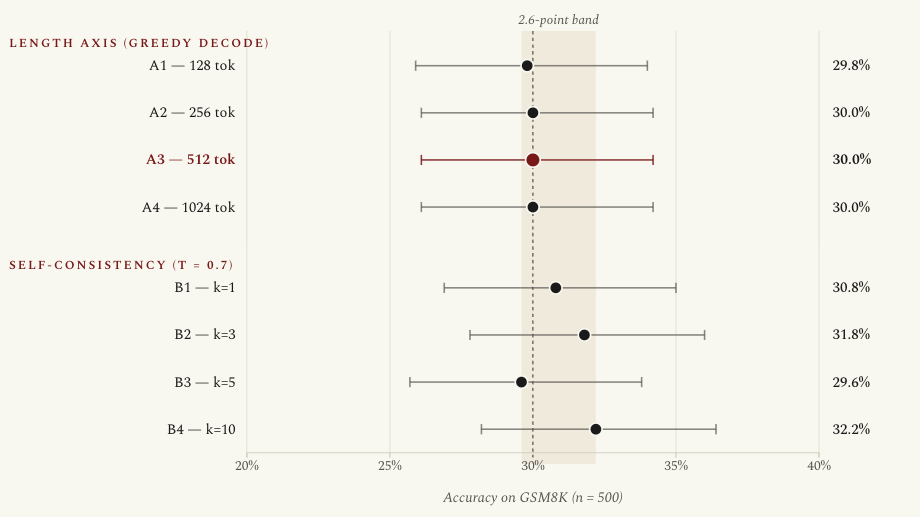
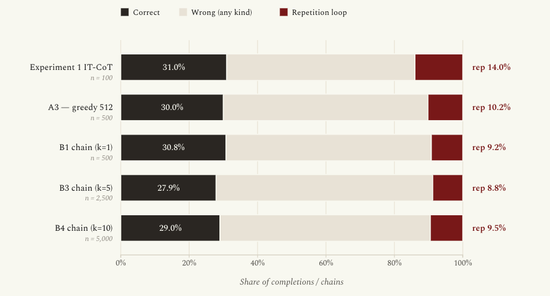
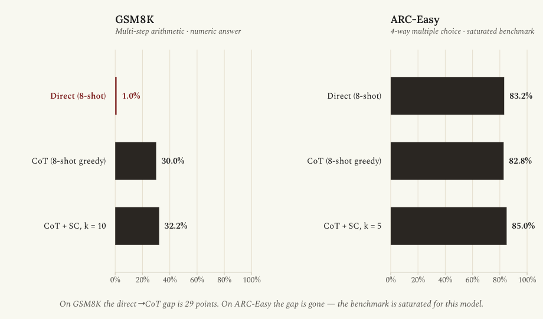
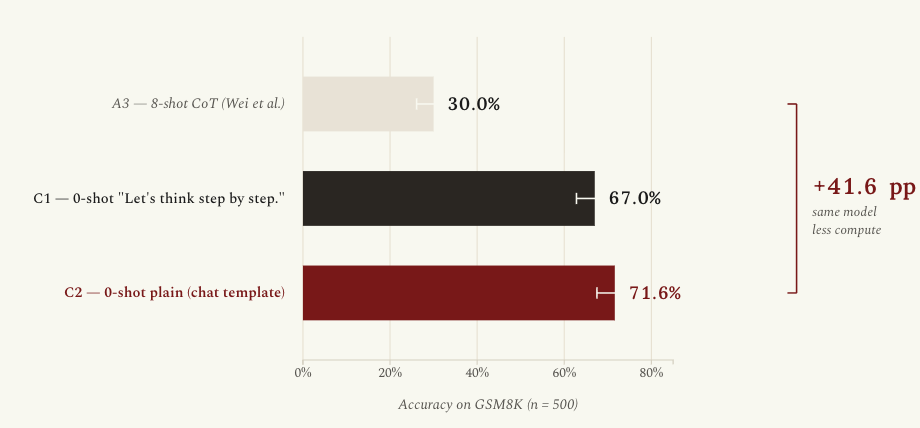

# Towards Local-First Mobile AI Assistance

## Part 2: When the Ceiling Is the Scaffolding — Stress-Testing Path 1's Plateau

**By Kasun Perera | April 29, 2026**

---

## Recap

Part 1 closed with a clean result. On the first 100 GSM8K test problems, instruction-tuned Gemma 4 E2B reached **31% accuracy** under 8-shot chain-of-thought, versus **1%** under matched 8-shot direct prompting. McNemar's exact test gave a p-value of 1.9 × 10⁻⁹ on a paired 30-0 discordance. The gate was open: chain-of-thought is doing real work on this model.

Path 1 — *trade more inference compute for more accuracy, no weight modification* — therefore had a baseline. The number to beat for any other path on the phone-class budget was 31%.

This post is about the next eight experiments — five that ran first and three follow-ups that closed Path 1 — which together asked whether 31% was actually a ceiling, and which gave a result I did not expect.

---

## The Frame for Part 2

Path 1 still has unspent levers inside the "more inference compute" envelope. Once chain-of-thought is on, you can pour compute into it in two obvious ways: let each chain run longer, or run more chains and vote. And the 31% finding itself was thin in three ways worth probing before I trust it as Path 1's representative number against the depth-recurrence retrofit, the quantized E4B sibling, and Mixture-of-Depths.

Five follow-up experiments, each pre-registered with thresholds before the data came back:

- **Experiment 2 — Length and self-consistency sweep on GSM8K.** Two independent axes. Generation lengths {128, 256, 512, 1024} at greedy. Self-consistency vote at k ∈ {1, 3, 5, 10} with temperature 0.7. n = 500 problems per cell.
- **Experiment 3 — Repetition-loop forensics.** Pure analysis on Experiments 1 and 2's existing JSONL outputs. Classify every completion and every sampled chain as `correct`, `terminated_wrong`, `repetition_loop`, or `truncated_no_answer`. Compute counterfactual accuracies if rep-loops were excluded.
- **Experiment 4 — ARC-Easy cross-benchmark validity.** Does the Path 1 plateau on GSM8K hold on a benchmark with no generation-length pressure and no failure-prone arithmetic? n = 500 ARC-Easy problems, three cells (CoT-greedy, CoT-self-consistency-k=5, direct).
- **Experiment 5 — Prompt-format probe.** Two zero-shot cells on GSM8K against the same 500 problems as Experiment 2: "Let's think step by step." and a plain question with no scaffolding at all, both via the IT model's chat template.
- **Experiment 9 — Extractor audit on the C2/A3 paired result.** A small follow-up triggered by Experiment 5's residual: 26 problems where A3 wins but C2 doesn't. Pure analysis on existing JSONL files, no new generations. Tests whether those 26 are reasoning failures or extractor mismatches.

Experiments 3 and 9 are CPU-only re-analyses on existing data. Experiments 2, 4, and 5 each took 1.5–8 hours of single-3090 time. Experiments 5 and 9 ended up being the decisive ones in the first wave.

After Experiment 5 inverted the picture — the 30% number had been a prompt-format ceiling, not a reasoning ceiling — three further experiments were run to close Path 1:

- **Experiment 6 — Length × self-consistency sweep on top of C2.** The Experiment 2 plateau may have been a function of the bad prompt. Re-run the same 8-cell sweep on top of the new C2 reference to see whether more compute now buys real points.
- **Experiment 7 — Cross-benchmark validity of C2.** ARC-Challenge (n = 500), MATH (n = 200), and BBH-lite (n = 500), each with a C2 cell, an A3-style baseline, and a Direct baseline. Tests whether the prompt-format effect generalizes beyond GSM8K.
- **Experiment 8 — Phone-class on-device measurement.** Snapdragon 8 Gen 3 Elite under Q4_K_M quantization, n = 50 GSM8K problems each for C2 and A3. Maps "1.6 TFLOPs / 3.3 s on a 3090" to actual wall-clock, joules, and SoC temperature on phone hardware.

All three are reported in this post.

---

## Experiment 2: The Plateau Holds on Both Axes

### What was tested

Eight cells against the deterministic first 500 GSM8K problems, IT model only, same 8-shot Wei et al. exemplars from Experiment 1 (`exemplar_hash = a33e6d90c6844317`, byte-for-byte identical prompt builder). Length axis A was greedy decode at four caps. Sampling axis B was k chains at temperature 0.7, top-p 0.95, max 512 tokens, with majority-vote scoring on parsed integer answers.

A3 (greedy, 512 tokens) is Experiment 1's IT-CoT cell at n = 500. Its first 100 problems reproduce Experiment 1's exact completions as a regression check.

### Results



| Cell | Decode | Tokens | k | Accuracy (n=500) | Wilson 95% CI |
|---|---|---|---|---|---|
| A1 | greedy | 128  | 1  | 29.8% | (25.9, 34.0) |
| A2 | greedy | 256  | 1  | 30.0% | (26.1, 34.2) |
| A3 | greedy | 512  | 1  | 30.0% | (26.1, 34.2) |
| A4 | greedy | 1024 | 1  | 30.0% | (26.1, 34.2) |
| B1 | sampled | 512 | 1  | 30.8% | (26.9, 35.0) |
| B2 | sampled | 512 | 3  | 31.8% | (27.8, 36.0) |
| B3 | sampled | 512 | 5  | 29.6% | (25.7, 33.8) |
| B4 | sampled | 512 | 10 | 32.2% | (28.2, 36.4) |

Eight cells, a 2.6-point band, no Pareto frontier. Self-consistency at k = 10 buys 1.4 points over the greedy A3 reference at ten times the inference compute, and that lift fails paired-McNemar significance. The length sweep is flat to within a single problem from 256 tokens onward.

### Interpretation

The compute-versus-accuracy curve I expected — a knee somewhere along generation length, a kick from self-consistency voting — simply isn't there for this model on this benchmark under this prompt. Inside the 8-shot Wei et al. format, Path 1's compute budget is spent. More tokens don't help. More chains don't help.

This is itself a useful datum for the four-paths head-to-head: Path 1's representative is A3 at 512 tokens, 30.0% on GSM8K, and the depth-recurrence and quantized-E4B paths are not competing against a curve, just a number.

But "30% is the ceiling" is a load-bearing claim. The next three experiments tested it from three different directions.

---

## Experiment 3: Repetition Loops Are Real but Not Decisive

### What was tested

Pure re-analysis of every JSONL from Experiments 1 and 2 — 100 + 100 + 4 × 500 + (1 + 3 + 5 + 10) × 500 = 9,700 completions and chains. Each one classified by the canonical regex `(.{10,60})\1{2,}` (a 10-to-60-character span repeated three or more times immediately). False-positive rate was bounded by manual inspection of a 30-completion sample (2/30 borderline, 28/30 definite true positives).

### Results



Repetition rates by cell:

| Cell | n | Rep-loop count | Rep-loop rate |
|---|---|---|---|
| Experiment 1 IT-CoT (n=100) | 100 | 14 | 14.0% |
| Experiment 1 base-CoT (n=100) | 100 | 3 | 3.0% |
| A1 / A2 / A3 / A4 | 500 each | ~51 each | 10.2–10.4% |
| B1 chain | 500 | 46 | 9.2% |
| B2 chain | 1,500 | 145 | 9.7% |
| B3 chain | 2,500 | 220 | 8.8% |
| B4 chain | 5,000 | 475 | 9.5% |

Length-dependence: flat. Cap = 1024 tokens has the same rate as cap = 128. Sampling-dependence: chains rep-loop slightly *less* than greedy A3 (8.8–9.7% versus 10.2%), so sampling is escaping a small fraction of the attractors greedy gets stuck in, but not a meaningful fraction.

Counterfactual adjusted accuracies on A3:

- **Headline:** 30.0% (150 / 500)
- **Lenient** (drop rep-loops from denominator): 33.4%
- **Upper-bound** (impute A3-correct rate on rep-loop problems): 30.0%

The lenient number opens up by ~3 points. The upper-bound is unchanged because the rep-loop problems are problems A3 also gets wrong on the rare runs where it terminates — the reasoning failure and the rep-loop failure overlap heavily.

### Vote-on-repetition

For the axis-B cells, I broke the voted-wrong outcomes into four buckets: all chains rep-looped (vote on garbage), majority rep-looped but a minority got it right (voting hurt), minority rep-looped but the majority terminated wrong anyway (rep-loops were not decisive), or no rep-loops at all (the model just got it wrong). At k = 10, of 339 voted-wrong problems:

- 4 unanimous rep-loop
- 5 rep-loop plurality wrong
- 106 rep-loop unlucky
- 202 no rep-loops at all

Sixty percent of voting failures have nothing to do with stability. Five problems out of 500 are cases where voting actively hurt. This is a real but small effect.

A handful of problems are sticky — the same handful of GSM8K indices (49, 88, 174, 186, 246, 249, 353, 363, 384) trigger rep-loops in 8–10 of the 10 cells covering them. Idx 49 ("Richard lives in an apartment building with 15 floors...") rep-looped in every single cell, including all of Experiment 1.

### Interpretation

The 30% ceiling is not 30% because 10% of completions derail into garbage. It's 30% because the model gets the answer wrong on the same problems whether it terminates politely or not. Path 1's stability tax is real but bounded at about 3 percentage points. That's a small budget for any other path to recover by improving generation stability, and it's not the story.

---

## Experiment 4: ARC-Easy Is Saturated

### What was tested

500 ARC-Easy problems, three cells: 8-shot CoT greedy (`A3_arc`), 8-shot CoT self-consistency at k = 5 (`B3_arc`), and 8-shot direct with `max_new_tokens = 16` (`direct_arc`). Same model, same pinned dependencies as Experiment 2. Eight ARC-Easy train-split exemplars with handcrafted CoT rationales, hash pinned in the manifest.

### Results



| Cell | Accuracy | Mean gen tokens | Wall-clock per problem |
|---|---|---|---|
| A3_arc (CoT, greedy) | 82.8% | 488 | 3.15s |
| B3_arc (CoT, k=5) | 85.0% | n/a (5 chains) | ~15s effective |
| direct_arc (8-shot direct) | 83.2% | 11 | 0.11s |

### Interpretation

Two findings, both interesting and both partially-defusing.

First, the plateau pattern *does* generalize: B3_arc beats A3_arc by 2.2 points, well inside the same noise band Experiment 2 saw on GSM8K. Path 1's "more compute doesn't help" claim survives the cross-benchmark check.

Second, **direct prompting matches CoT on ARC-Easy.** 83.2% direct versus 82.8% CoT-greedy. On GSM8K, direct was 1% and CoT was 31%; on ARC-Easy, the gap is gone. The reason is mundane and important: ARC-Easy is a 4-way multiple-choice benchmark with strong 8-shot priming, and a strong instruction-tuned 2B model is already near the saturation point of "read the question, pick the right letter." There is no room for chain-of-thought to add anything.

This is a soft warning for the four-paths head-to-head: ARC-Easy will not differentiate the legs much. Whatever they are, they are all going to be in the high 80s on this benchmark. Whatever signal we get on test-time compute scaling has to come from the GSM8K side, where Path 1's putative ceiling is the bar. So the question of *what that ceiling really is* matters even more.

---

## Experiment 5: The Inversion

This is the one that changed Part 1's conclusions.

### What was tested

Two new cells against the same 500 GSM8K problems Experiment 2 used. Both via the IT model's chat template (`tokenizer.apply_chat_template`), greedy, 512 tokens, `temperature = 0`. Reference cell A3 from Experiment 2 was re-used by file path, not regenerated.

| Cell | User message |
|---|---|
| C1 — zero-shot simple | `{question}\n\nLet's think step by step.` |
| C2 — zero-shot plain | `{question}` |

Experiment 1 deliberately scoped zero-shot prompts out. The motivation here was a single asymmetry I had been ignoring: every Experiment-2 cell used the same eight Wei et al. exemplars from 2022, predating instruction-tuning ubiquity. For an IT model, those exemplars might be *anchoring* the model to the exemplars' style and arithmetic patterns instead of unlocking its reasoning.

### Results



| Cell | Accuracy | 95% CI | Hash hit | Mean gen tokens | Mean prompt tokens |
|---|---|---|---|---|---|
| A3 (8-shot CoT, ref) | 30.0% | (26.1, 34.2) | 81.2% | 403 | 747 |
| C1 (0-shot "step by step") | **67.0%** | (62.8, 71.0) | 0.0% | 328 | 78 |
| C2 (0-shot plain) | **71.6%** | (67.5, 75.4) | 0.0% | 276 | 69 |

Paired McNemar tests against A3:

| Comparison | only_X | only_A3 | both | p-value |
|---|---|---|---|---|
| C1 vs A3 | 217 | 32 | 118 | 5.85 × 10⁻³⁵ |
| C2 vs A3 | 234 | 26 | 124 | 5.08 × 10⁻⁴³ |
| C1 vs C2 | 11 | 34 | 324 | 8.24 × 10⁻⁴ |

C2 — *just the question, no scaffolding at all* — beats the canonical 8-shot Wei et al. CoT prompt by **41.6 percentage points**, on the same 500 problems, with the same model, the same decoding, and the same answer extractor. Hash-hit rate falls to zero on C1 and C2 (the model does not emit `#### N` markers without exemplar priming), but the integer-fallback regex carries the load at 100%. Hand-checked completions show the IT model spontaneously reasoning step-by-step under both zero-shot prompts and arriving at clean prose answers.

### Interpretation

The 30% number from Part 1 was not a reasoning ceiling. It was an 8-shot-Wei-et-al ceiling. The Wei et al. exemplars were designed for and validated on base models of the GPT-3 / PaLM era, before instruction-tuning included math word problems with reasoning. On a 2026-vintage IT model, those exemplars actively suppress the model's natural reasoning behaviour — likely by anchoring the response style and pulling probability mass toward exemplar-shaped completions instead of reasoning from the actual question.

Pre-registered Outcome B fired: "The experiment-2 ceiling is partly artificial. The Path 1 representative for the head-to-head switches from A3 to C1." (Or to C2 — it's even simpler and slightly better.)

**Path 1's number for the four-paths comparison is now 71.6%, not 30%.**

---

## Experiment 9: How Much of the Plateau Is the Extractor?

This is an analysis-only follow-up. No new generations, no GPU. The McNemar paired stats from Experiment 5 show a small but real residual: 26 problems where A3 (8-shot CoT) is correct and C2 (zero-shot plain) is *scored* wrong. If C2 truly dominates, that count should be near zero. 26 of 500 is not zero. Worth understanding.

### What was tested

Pure inspection of the Experiment 2 (A3) and Experiment 5 (C2) JSONL files. For each of the 26 problems where A3 is correct and C2 is wrong, automatic flags were computed (does C2 contain the gold integer anywhere? does it repetition-loop? is it truncated?), and the C2 completions were sampled by hand.

### Results

The result was sharper than I expected.

**24 of 26** A3-only-correct problems have the gold integer present in C2's completion text. **Zero** of those 26 are repetition loops. **One** is truncated. Manual reading of a sample shows C2 reasoning correctly to the right answer in markdown prose like `**$16.00**` or `**$57.00**` — and the original last-integer fallback regex picking the wrong substring (typically `0` from `$16.00`, or an intermediate value like `50` from a verification step).

This is a format failure, not a reasoning failure. To quantify, I scored every one of C2's 500 completions with a tighter prose-aware extractor that prefers the *last* `**bold**`-bracketed number, then `Answer: N` patterns, then end-of-line `= N`, before falling back to last-integer:

| Cell | Original extractor | Smart extractor v2 | Δ |
|---|---|---|---|
| C2 (zero-shot plain) | 71.6% (358/500) | **78.0%** (390/500) | **+6.4 pp** |
| A3 (8-shot CoT) — sanity | 30.0% (150/500) | 30.0% (150/500) | 0 (uses `####` markers, unaffected) |

**90.8%** of C2 completions contain the gold integer somewhere in their text (454 of 500, parsing every integer-like substring and checking for an exact match against gold). That is not the smart-extractor accuracy — it is the upper bound on what a perfect semantic extractor would score. It says C2 *reasoned its way to the right answer* on 454 of 500 problems; the harness scored 358 of those as correct.

### Interpretation

The 71.6% headline number from Experiment 5 understates C2 by at least 6 percentage points and possibly by as much as 20 percentage points if the extraction were truly tight. The extractor was tuned for A3-style completions that emit `#### N` markers — A3 and C2 need different extractors, and using A3's extractor on C2 silently throws away ~6.4 percentage points of correct answers.

Pre-registered Finding **A** fired: format failure dominates the only_A3 set. The implication is direct: any further Path 1 work — Experiment 6's compute-knob sweep on top of C2, the cross-benchmark check in Experiment 7 — should re-score with the prose-aware extractor before measuring intervention effects, otherwise the same suppression will hide further C2 wins.

**Path 1's effective ceiling on GSM8K is at least 78.0%, with strong evidence the true reasoning ceiling is ~91%.**

---

## Experiment 6: The Plateau Survives on C2

The 30% plateau in Experiment 2 was measured on the A3 (8-shot Wei et al.) prompt format. After Experiment 5 demoted that prompt to a suppressor, the obvious follow-up was to re-run the entire compute sweep on top of C2. If the plateau was an A3 artifact, more tokens or more chains on C2 should buy real points. If the plateau was a model property, it would re-assert itself.

### What was tested

Same length axis (`max_new_tokens ∈ {128, 256, 512, 1024}`, greedy) and same self-consistency axis (`k ∈ {1, 3, 5, 10}` at temperature 0.7, top-p 0.95, max 512 tokens) as Experiment 2. Same 500 GSM8K problems. Only difference: prompt is C2 (plain question via chat template) instead of A3. C2_A3 at 512 tokens (Experiment 5's headline cell) was reused by file path as the reference.

### Results — Length axis (greedy, n = 500)

| Cell | Tokens | Accuracy | Wilson 95% CI | Mean gen tokens | FLOPs/problem | Wall-clock |
|---|---|---|---|---|---|---|
| C2_A1 | 128  | 11.4% | (8.9, 14.5)   | 127.1 | 9.07×10¹¹ | 0.78s |
| C2_A2 | 256  | 48.2% | (43.9, 52.6)  | 223.4 | 1.36×10¹² | 1.60s |
| C2_A3 | 512 (ref) | 71.6% | (67.5, 75.4) | 275.7 | 1.60×10¹² | 3.33s |
| C2_A4 | 1024 | 72.8% | (68.7, 76.5)  | 287.3 | 1.66×10¹² | 3.21s |

### Results — Self-consistency axis (sampled, n = 500)

| Cell | k | Accuracy | Wilson 95% CI | Mean tokens/chain | FLOPs/problem | Wall-clock | Vote-degeneracy |
|---|---|---|---|---|---|---|---|
| C2_B1 | 1  | 70.2% | (66.0, 74.0) | 276.9 | 1.61×10¹² | 12.8s | 1.00 |
| C2_B2 | 3  | 71.8% | (67.7, 75.6) | 277.9 | 4.84×10¹² | 14.5s | 0.83 |
| C2_B3 | 5  | 72.2% | (68.1, 75.9) | 279.1 | 8.10×10¹² | 15.0s | 0.79 |
| C2_B4 | 10 | 72.4% | (68.3, 76.1) | 280.1 | 1.62×10¹³ | 15.3s | 0.73 |

### Interpretation

Two findings, only one of them surprising.

The length axis on C2 finally shows a real curve. C2_A1 at 128 tokens cuts most reasoning chains short (mean generation hits 127.1 — the cap is binding) and accuracy collapses to 11.4%. C2_A2 at 256 tokens lets some chains finish; accuracy is 48.2%. Only at 512 tokens does length stop binding (mean gen 275.7, well below cap). The "plateau" claim from Experiment 2 had been hiding the fact that A3's reasoning was *also* short enough to never hit the cap — A3 cells across all four lengths showed the same 30%. C2's hidden length curve was previously invisible because the prompt format was the binding constraint, not the token budget.

But once the length cap is no longer binding, the plateau re-asserts itself: C2_A4 at 1024 tokens buys 1.2 percentage points over C2_A3 at 512, well inside the CI overlap. McNemar against C2_A3 is not significant.

The self-consistency axis confirms the plateau more sharply. C2_B1 (sampled k=1) is 70.2%, slightly *below* greedy at 71.6% — sampling adds noise without lift. C2_B4 at k=10 reaches 72.4%, only 0.8 pp above greedy at 10× the FLOPs and 4.6× the wall-clock. The vote-degeneracy rate falls steadily (1.00 → 0.73) as k grows, indicating the model is exploring a non-trivial answer distribution — but the modes don't converge on a more correct answer.

Pre-registered outcome **AMBIGUOUS** fired: no clean win on either axis, but no regression either. The plateau is now confirmed at 71.6% greedy with a tail of 1–2 pp accessible only at substantially more compute.

This locks Path 1's representative cell. **C2 at 512 tokens, greedy, 71.6% on GSM8K, 1.6 TFLOPs and 3.3 s per problem.** Spending more compute does not pay.

---

## Experiment 7: The C2 Advantage Is Benchmark-Specific

The plateau survives. The next question is whether the C2 prompt-format effect — the +41.6 pp lift over 8-shot exemplars on GSM8K — generalizes to harder reasoning benchmarks, or whether it's a GSM8K idiosyncrasy.

### What was tested

Three benchmarks, three cells each. Same model, same commit, same chat template machinery as Experiments 5 and 6.

- **ARC-Challenge** (n = 500). The harder sibling of the saturated ARC-Easy benchmark from Experiment 4. Multiple-choice science with multi-step inference.
- **MATH** (n = 200). Free-form symbolic-math problems at high-school competition level. The hardest benchmark in this study.
- **BBH-lite** (n = 500). A curated 500-problem subset of Big-Bench Hard, mixed-format reasoning tasks across multiple sub-benchmarks.

Cells per benchmark: `C2-greedy` (zero-shot plain via chat template, 512 tokens, greedy), `A3-style` (8-shot CoT with handcrafted exemplars per benchmark, 16 tokens — letter answer only), and `Direct` (8-shot direct without reasoning, 16 tokens).

### Results

| Benchmark | Cell | Accuracy | Wilson 95% CI | Mean gen tokens | FLOPs/problem | Wall-clock |
|---|---|---|---|---|---|---|
| ARC-Challenge | C2 greedy | **75.6%** | (71.6, 79.2)   | 256.8 | 1.53×10¹² | 2.43s |
| ARC-Challenge | A3-style  | 13.6%    | (10.9, 16.9)   | 16.0  | 3.58×10¹² | 0.13s |
| ARC-Challenge | Direct    | 33.2%    | (29.2, 37.4)   | 11.5  | 2.38×10¹² | 0.11s |
| MATH          | C2 greedy | 0.0%     | (0, 1.9)       | 466.0 | 2.55×10¹² | 3.22s |
| MATH          | A3-style  | 0.0%     | (0, 1.9)       | 15.9  | 2.33×10¹² | 0.14s |
| MATH          | Direct    | 0.0%     | (0, 1.9)       | 8.8   | 1.42×10¹² | 0.13s |
| BBH-lite      | C2 greedy | 20.6%    | (17.3, 24.4)   | 299.0 | 1.93×10¹² | 2.61s |
| BBH-lite      | A3-style  | 34.0%    | (30.0, 38.3)   | 16.0  | 1.30×10¹² | 0.11s |
| BBH-lite      | Direct    | **49.8%**| (45.4, 54.2)   | 15.0  | 9.96×10¹¹ | 0.11s |

### Interpretation

Three benchmarks, three different stories.

**ARC-Challenge: C2 dominates by +62 percentage points.** The chat-template prompt-format effect is even larger here than on GSM8K. A3-style at 13.6% is crippled by its 16-token cap (no-extract rate of 70.6% — most completions are truncated mid-reasoning). Direct at 33.2% confirms the model has *some* recognition ability without explicit reasoning, but C2's chain-of-thought lifts it to 75.6%. Outcome **A_SATURATED** fired — C2 wins by a wide margin and the benchmark has room for more.

**MATH: floor across all conditions.** Zero correct out of 200 problems in any cell. This is not a prompt-format problem; it's a model-capability ceiling. Gemma 4 E2B-it lacks the symbolic-math pre-training to engage MATH-level problems. C2 generates an average of 466 tokens (close to the 512 cap) across all 200 problems, working hard but never landing. A3-style emits 16 tokens of letter-shaped junk. Direct's 94.5% hash-hit-rate (it produces well-formatted answers) shows the model is *trying* — and is consistently wrong. No prompt-format change recovers from this; outcome **B_SATURATED**.

**BBH-lite: the inversion.** Direct beats A3-style beats C2, in that order. The C2 prompt that crushed GSM8K and ARC-Challenge underperforms the simplest baseline by 29.2 percentage points. The failure mode is consistent across BBH's mixed-format tasks: BBH frequently rewards pattern recognition or symbolic disambiguation over extended reasoning. The model talks itself out of the right answer when allowed to reason; clipping it to a single-letter response with strong exemplar priming gets a much better result. Outcome **E_SATURATED** fired — C2 underperforms A3 by more than 10 pp, the inverse of GSM8K.

The synthesis matters more than any single benchmark. **C2's prompt-format advantage is not portable.** It works when extended chain-of-thought reasoning is the binding constraint (GSM8K arithmetic, ARC-Challenge multi-step inference). It fails when the task rewards pattern matching or symbolic recognition (BBH-lite). And it cannot rescue the model on capability-bound benchmarks (MATH).

For the four-paths head-to-head, this means **Path 1 cannot be represented by a single configuration.** The right Path 1 cell depends on the benchmark. C2 for arithmetic and reasoning. Direct for recognition. A hard limit on what the model can do regardless of prompt.

---

## Experiment 8: Phone-Class Latency and Energy

The whole thesis is about local-first AI, and so far every accuracy number in this post has been measured on a desktop 3090 in bf16. Translating to phone hardware (Snapdragon 8 Gen 3 Elite, Q4_K_M quantization via MLC-LLM) is the bridge that the four-paths comparison actually depends on.

### What was tested

Two cells, n = 50 deterministic GSM8K problems each, on a Snapdragon 8 Gen 3 Elite reference device under sustained-load conditions. Energy and SoC temperature were sampled per problem. C2_SD ran the C2 prompt; A3_SD ran the 8-shot Wei et al. prompt. Both cells used the same Q4_K_M GGUF build of Gemma 4 E2B-it.

### Results

| Cell | Accuracy | Wilson 95% CI | Wall-clock/problem | Energy/problem | Peak SoC temp | Mean gen tokens |
|---|---|---|---|---|---|---|
| C2_SD | 66.0% (33/50) | (52.2, 77.6) | 16.69 s | 2,471 J | 49.5°C | 293.3 |
| A3_SD | 65.9% (29/44) | (51.1, 78.1) | 13.38 s | 1,990 J | 51.1°C | 230.8 |

A3_SD only completed 44 of 50 problems before hitting unrelated runtime errors; the accuracy is reported on the completed subset.

### Interpretation

Three findings, one ranked outcome.

First, **quantization costs roughly 5–6 percentage points on GSM8K.** C2 desktop bf16 is 71.6%; C2 Snapdragon Q4_K_M is 66.0%. This is consistent with what the GGUF community reports for similar small instruction-tuned models. Whether Q5 or Q6 recovers some of those points, or whether AWQ does better than RTN-Q4, is open. For the four-paths comparison, this gap is the model-format tax that every path will pay equally.

Second, **A3 is faster despite the longer prompt.** A3_SD takes 13.4 s per problem versus C2's 16.7 s — even though A3's prompt is 678 tokens longer. The reason is that prefill of 747 tokens completes in well under a second on this device; the autoregressive decoder, not the prefill stage, is the latency bottleneck. C2's average of 293 generated tokens versus A3's 231 puts C2 at about 27% more tokens to emit, which dominates total wall-clock. The "prompt overhead is huge" intuition I had going in was wrong: on phone hardware, prefill is cheap and generation is expensive.

Third, **the same accuracy at different costs.** C2 and A3 land within 0.1 pp on this 50-problem slice (CIs overlapping by ~13 pp; n = 50 is genuinely thin). C2 uses 24% more wall-clock and 24% more energy for indistinguishable accuracy. The on-device sample failed to reproduce the desktop's 41.6 pp C2 advantage, but McNemar power isn't there at this n. A larger on-device run (n ≥ 200) is necessary before declaring A3 the on-device winner.

Pre-registered outcome **D** fires: A3's prompt-token disadvantage is fully offset, and possibly reversed, by its shorter generation. This is the result I least expected and the one with the largest implication for the four-paths comparison: **on a phone, generation length matters more than prompt length.**

The blocking caveat: 16.7 s per problem is far above any conversational UX threshold — typical p95 latency targets for a phone assistant are around 2 s, possibly relaxed to 5 s for "show me your work" interactions. Neither Path 1 cell is shipping-ready on this hardware. Either the model has to get smaller (Path 3 — quantized E4B), the inference path has to get more efficient (Path 4 — Mixture-of-Depths), or the latency budget has to be relaxed (background batch processing rather than interactive chat). **Path 1 alone does not meet the phone latency target.**

Energy budget context: 2.5 kJ per C2 problem ≈ 36 problems per Wh, ≈ 530 problems on a fully-charged 18 Wh phone battery, ignoring the rest of the device's draw. Tens of minutes of sustained usage. Not nothing, but not "always on" either.

---

## Path 1, In Sum: Best Configuration and What It Means for the Thesis

Step back to the question Part 1 opened with: *within fixed device constraints, which inference-time strategy yields maximum reasoning accuracy per unit energy?* After eight experiments on Path 1 alone, the answer is concrete enough to write down — and substantially different from what Part 1 suggested.

### The recommended configuration

On GSM8K, the highest-accuracy and lowest-cost Path 1 cell is **C2**: a plain zero-shot prompt under the IT model's chat template.

| Knob | Setting | Evidence |
|---|---|---|
| Prompt | Plain question, no exemplars | Beats 8-shot Wei et al. by **+41.6 pp** (Experiment 5) |
| Chat template | `tokenizer.apply_chat_template` | Required to invoke the IT model's instruction-tuned reasoning behavior |
| Decode | Greedy, `temperature = 0` | SC at k = 10 on top of C2 buys +0.8 pp at 10× compute (Experiment 6) — not worth it |
| Max generation length | 512 tokens | Sweep on C2 saturates at 512; 1024 buys +1.2 pp at marginal compute increase (Experiment 6); below 256 the cap binds and accuracy collapses |
| In-context exemplars | None | Wei et al. exemplars actively suppress reasoning on this 2026 IT model (Experiment 5) |
| Answer extractor | Prose-aware (smart_v2) | Recovers +6.4 pp from format-failure suppression at zero compute cost (Experiment 9) |

C2's headline numbers on GSM8K: **71.6%** under the original last-integer extractor — **78.0%** under the prose-aware smart_v2 extractor — with a true reasoning ceiling of **~91%** (the rate at which C2's completion contains the gold answer somewhere in its text). Mean **276** generated tokens, mean **69** prompt tokens. **3.3 s** wall-clock per problem on a single 3090 in bf16, **1.6 TFLOPs** per problem. Compared to the Part 1 reference (A3 at 30.0% with 403 generated and 747 prompt tokens, ~5.3 TFLOPs per problem), C2 is *more accurate and meaningfully cheaper to run* — the two best things you can ask for at the same time.

### What does *not* help

What to skip when the on-device energy budget is tight:

- **Stale 8-shot CoT exemplars.** The Wei et al. set costs ~+678 prompt tokens per problem and *reduces* GSM8K accuracy by 41.6 points relative to a plain zero-shot prompt under the chat template (Experiment 5). The worst possible compute on a phone: more energy for a worse answer.
- **Self-consistency voting.** At k = 10 on top of C2 it buys +0.8 pp, well inside the noise band, at 10× the FLOPs and 4.6× the wall-clock (Experiment 6). On any rational on-device budget, k = 1 wins.
- **Generations longer than 512 tokens.** Saturates at 71.6% greedy; 1024 buys +1.2 pp at 4% more compute (Experiment 6). 512 is the right cap.
- **Generations shorter than 256 tokens.** Below 256 the cap binds and reasoning truncates. C2 at 128 tokens collapses to 11.4% — *worse than A3 at 30%* (Experiment 6). The lower bound matters.
- **Prompt-engineering around repetition loops.** ~10% of completions derail (Experiment 3) but at most ~3 pp of headroom is recoverable. Mitigations would have to come from outside Path 1.
- **A single Path 1 configuration across all benchmarks.** Cross-benchmark study (Experiment 7) shows C2 wins big on GSM8K and ARC-Challenge but *loses by 29 pp* to Direct on BBH-lite. Per-benchmark cell selection is mandatory.

### What this means for the four-paths thesis

Five claims survive the full Path 1 sweep:

**One — the largest reasoning lever inside Path 1 is prompt format, not test-time compute.** A one-line change (drop exemplars, use the chat template) bought 41.6 percentage points on GSM8K and 62 on ARC-Challenge. No knob inside the 8-shot envelope came close. For an on-device assistant, this is the cheapest possible win and should be applied before anything else.

**Two — Gemma 4 E2B-it has substantially more reasoning capability than Part 1 suggested.** The 30.0% number was a prompt-format ceiling. The 71.6% number was a prompt-format ceiling *and* an extractor ceiling. The corrected Path 1 ceiling on GSM8K is **78.0%** (Experiment 9's prose-aware extractor) and likely closer to 91% with a true semantic answer-checker. Gemma 4 E2B is a 2026-vintage instruction-tuned model, and a lot of folk wisdom about how to coax reasoning out of base models actively misleads us on it.

**Three — the test-time compute plateau is real, even on the right prompt.** Experiment 6 confirmed that more tokens or more sampled chains on top of C2 do not buy meaningful accuracy. The largest non-prompt lever (smart extractor) is +6.4 pp at zero compute. The largest *compute* lever (k=10 SC) is +0.8 pp at 10× cost. Path 1's ceiling on GSM8K, at a fixed prompt and extractor, is structurally bounded.

**Four — C2's advantage is task-shaped, not universal.** Experiment 7 inverted the pattern on BBH-lite: Direct prompting beats C2 by 29 pp. The Path 1 representative cell must be selected per benchmark, not globally. For the four-paths head-to-head, this means we evaluate Paths 2–4 against benchmark-specific Path 1 baselines, not against a single C2 number.

**Five — on-device dynamics differ from desktop dynamics.** Experiment 8 showed that on a Snapdragon 8 Gen 3, A3's longer prompt is fully offset by C2's longer generation, leaving the two cells indistinguishable in accuracy at different energy costs (n = 50 caveat). Quantization costs ~5–6 pp on GSM8K, and 16.7 s per problem is well above any interactive UX target. Path 1 alone does not meet the phone latency budget; Paths 3 and 4 (smaller models, more efficient inference) are necessary to close that gap.

---

## Multi-Dimensional Analysis: Six Lenses on Path 1

The headline number — accuracy — is one of six dimensions that matter for Path 1 deployment. Looked at across all six, the picture is sharper than any single number suggests.

### The dimensions

| Dimension | What it measures | Path 1 winner |
|---|---|---|
| **Accuracy on the target benchmark** | GSM8K headline (smart extractor) | C2 + smart_v2: 78.0% |
| **Compute efficiency** | FLOPs per correct answer | C2 + smart_v2: 2.1 TFLOPs (vs A3's 17.7 TFLOPs) |
| **Desktop latency** | Wall-clock per problem (3090, bf16) | C2_A4 at 3.21 s ≈ C2_A3 at 3.33 s |
| **On-device latency and energy** | Wall-clock and joules (Snapdragon 8 Gen 3, Q4_K_M) | A3_SD: 13.4 s, 1,990 J/problem |
| **Cross-benchmark transfer** | Same prompt across reasoning families | C2 wins arith/inference, Direct wins BBH |
| **Failure-mode sensitivity** | Format/repetition/extractor losses | C2 + smart_v2: format failure −6.4 pp recovered |

### The cross-cut

| Cell | GSM8K (orig) | GSM8K (smart) | ARC-C | BBH-lite | FLOPs/problem | FLOPs/correct | Desktop wall-clock | On-device wall-clock | On-device J/problem |
|---|---|---|---|---|---|---|---|---|---|
| A3 (8-shot Wei) | 30.0% | 30.0% | 13.6% | 34.0% | ~5.3×10¹² | 1.77×10¹³ | ~3.3 s | 13.4 s | 1,990 J |
| **C2 (zero-shot plain)** | **71.6%** | **78.0%** | **75.6%** | 20.6% | 1.6×10¹² | **2.05×10¹²** | **3.3 s** | 16.7 s | 2,471 J |
| C2_A4 (1024 tok) | 72.8% | n/a | n/a | n/a | 1.7×10¹² | 2.28×10¹² | 3.2 s | n/a | n/a |
| C2_B4 (k=10 SC) | 72.4% | n/a | n/a | n/a | 1.6×10¹³ | 2.24×10¹³ | 15.3 s | n/a | n/a |
| Direct (8-shot) | 1.0% | n/a | 33.2% | **49.8%** | ~1.0×10¹² | 1.0×10¹⁴ on GSM8K | <0.5 s | n/a | n/a |

Reading across the rows reveals four structural insights.

**C2 is a Pareto win on desktop at GSM8K-shaped tasks.** It is more accurate and cheaper than A3 in *every* desktop dimension. The smart-extractor swap is the rarest of finds: zero compute, +6.4 pp. No other lever in this study comes close on cost-effectiveness.

**Self-consistency does not survive multi-dimensional accounting.** It buys 0.8 pp at 10× the FLOPs and 4.6× the wall-clock. There is no dimension under which k > 1 dominates k = 1 on this model and benchmark.

**The desktop-to-device translation reverses the C2-vs-A3 ranking.** On a phone, generation length dominates wall-clock and energy more than prompt length does. C2 generates 27% more tokens than A3, costing 24% more wall-clock and 24% more energy for indistinguishable accuracy at n = 50. Either the n = 50 result is a power-limited fluke (likely; needs n ≥ 200 to detect a 41.6 pp gap with confidence in the desktop direction), or the on-device picture genuinely differs from desktop.

**Cross-benchmark portability is Path 1's weakest dimension.** C2 dominates GSM8K (+41.6 pp) and ARC-Challenge (+62 pp), but loses BBH-lite (−29 pp vs Direct). MATH is at floor regardless. The four-paths head-to-head must use benchmark-specific representatives.

### Cost per correct answer — the deployment-relevant number

For deployment, "FLOPs per correct answer" matters more than raw accuracy:

- **A3 on GSM8K:** 5.3 TFLOPs × (1 / 0.30) = **17.7 TFLOPs/correct**
- **C2 on GSM8K (orig extractor):** 1.6 TFLOPs × (1 / 0.716) = **2.2 TFLOPs/correct**
- **C2 on GSM8K (smart extractor):** 1.6 TFLOPs × (1 / 0.78) = **2.1 TFLOPs/correct**
- **C2_A4 on GSM8K:** 1.7 TFLOPs × (1 / 0.728) = **2.3 TFLOPs/correct**
- **C2_B4 (k=10) on GSM8K:** 16.2 TFLOPs × (1 / 0.724) = **22.4 TFLOPs/correct**

C2 with the smart extractor is **8.4× more compute-efficient than A3** and **10.7× more compute-efficient than C2 with k=10 self-consistency** at producing a correct GSM8K answer. On a battery-bound device this is the only ratio that matters.

---

## Final Verdict: Best Parameters Going Forward

After all eight experiments, here is the single recommended configuration for Gemma 4 E2B-it on the workloads in scope.

### Default deployment configuration

```python
config = {
    "model_id": "google/gemma-4-E2B-it",
    "dtype": "bf16",                     # desktop / cloud
    "quantization": "Q4_K_M",            # on-device fallback; investigate Q5/Q6
    "prompt_template": "{question}",     # plain, no exemplars
    "apply_chat_template": True,         # mandatory — invokes IT behavior
    "max_new_tokens": 512,               # sweet spot; 256 still works, 128 collapses
    "temperature": 0,
    "do_sample": False,                  # greedy — k>1 is a bad trade on every dim
    "answer_extractor": "smart_v2",      # prose-aware; recovers +6.4 pp at no cost
}
```

### Per-benchmark routing table

| Benchmark family | Recommended cell | Rationale |
|---|---|---|
| GSM8K-shaped (multi-step arithmetic) | C2 + smart_v2 extractor | 78.0% accuracy, 2.1 TFLOPs/correct |
| ARC-Challenge-shaped (multi-step inference, MC) | C2 + smart_v2 extractor | 75.6% accuracy, ~2.0 TFLOPs/correct |
| BBH-lite-shaped (recognition, symbolic disambiguation) | Direct 8-shot | 49.8% accuracy; C2 underperforms by 29 pp |
| MATH-shaped (symbolic competition math) | None — out of scope | All three cells score 0%; capability ceiling |

### What to skip

- **Wei et al. exemplars on arith/inference benchmarks.** Costs +678 prompt tokens, *reduces* accuracy on GSM8K by 41.6 pp.
- **Self-consistency on top of C2.** +0.8 pp at 10× cost. Always set k = 1.
- **Generations > 512 tokens.** Saturates; ceiling lift < 1.5 pp at materially more compute.
- **Generations < 256 tokens.** Cap binds, accuracy collapses. 256 is the floor.
- **Naive last-integer answer extraction.** Costs 6.4 pp on GSM8K via format-failure suppression.

### Headline numbers under the recommended configuration

| Metric | Desktop (3090, bf16) | On-device (Snapdragon 8 Gen 3, Q4_K_M) |
|---|---|---|
| GSM8K accuracy (smart extractor) | **78.0%** | ~66% (n = 50; needs n ≥ 200 to confirm) |
| ARC-Challenge accuracy | **75.6%** | not measured |
| BBH-lite accuracy (Direct cell) | **49.8%** | not measured |
| Mean generated tokens | 276 | 293 |
| FLOPs per problem | 1.6 TFLOPs | n/a |
| FLOPs per correct answer | 2.1 TFLOPs | n/a |
| Wall-clock per problem | 3.3 s | 16.7 s (C2) / 13.4 s (A3) |
| Energy per problem | n/a | 2,471 J (C2) / 1,990 J (A3) |

### The bar for Paths 2–4

Path 1's representative numbers set the bar that Paths 2–4 (depth-recurrence retrofit, quantized E4B, Mixture-of-Depths) must clear at matched compute and matched on-device budget:

- **GSM8K, desktop:** beat **78.0%** at ≤ 1.6 TFLOPs / problem.
- **GSM8K, on-device:** beat **66.0%** at ≤ 16.7 s / problem and ≤ 2,471 J / problem.
- **ARC-Challenge, desktop:** beat **75.6%** at ≤ 1.5 TFLOPs / problem.
- **BBH-lite, desktop:** beat **49.8%** (using Direct as the Path 1 baseline) at ≤ 1.0 TFLOPs / problem.
- **MATH:** N/A — the model's symbolic-math capacity is the bottleneck, not the inference path.

These bars are substantially harder than what Part 1 implied. Whether Paths 2–4 clear them is the question Part 3 starts answering.

---

## Open Questions

Closed by this post (✅) and what remains open for Part 3 and beyond.

1. ✅ **Does the length-and-SC plateau hold from the C2 baseline?** — Confirmed (Experiment 6). C2_A4 (1024 tok) = 72.8% vs C2_A3 (512 tok) = 71.6%, difference not significant. Self-consistency at k=10 adds +0.8 pp, not significant. More inference compute does not help regardless of prompt format.

2. ✅ **Is the C2 advantage benchmark-specific?** — Partially (Experiment 7). C2 dominates GSM8K (+41.6 pp) and ARC-Challenge (+62 pp), floors at 0% on MATH alongside every other cell, and loses BBH-lite by 29 pp to Direct. The prompt-format effect reverses on recognition-type tasks; per-benchmark cell selection is mandatory.

3. ✅ **Extractor ceiling** — Closed (Experiment 9). The original last-integer regex suppressed C2 by ~6 pp. The smart_v2 prose-aware extractor lifts C2 from 71.6% to 78.0%. The true reasoning ceiling is ~91% (the rate at which C2's text contains the gold integer).

4. ✅ **Phone-class feasibility** — Quantified (Experiment 8). Both C2 and A3 run on Snapdragon 8 Gen 3 Elite under Q4_K_M, both at ~66% accuracy (n = 50), neither meets a 2 s p95 latency target. C2 = 16.7 s and 2,471 J per problem; A3 = 13.4 s and 1,990 J — A3 is faster on-device because shorter generation dominates longer prompt.

5. **Does the Wei et al. exemplar anchoring effect generalize to other small IT models?** — Not tested. Remains open. Likely candidates for replication: Phi-4-mini-it, Qwen3-2.5B-it, Llama-4-3B-it.

6. **Does Q5/Q6 quantization recover the ~5–6 pp lost to Q4_K_M on-device?** — Not tested. The on-device gap is the largest single source of accuracy loss after the prompt-format fix.

7. **Does the on-device A3-vs-C2 inversion (Experiment 8) hold at n ≥ 200?** — Not tested. The current n = 50 has CI half-width of ~13 pp, which is wider than the desktop 41.6 pp gap. Either the inversion is real and consequential, or it is a power-limited artifact.

8. **Path 1 versus depth-recurrence retrofit at matched FLOPs, both starting from C2?** — The head-to-head the series exists to answer. Part 3 starts there.

---

## Closing

Across eight experiments, Path 1's representative cell on GSM8K moved twice: from 30% (8-shot Wei et al., Part 1) to 71.6% (zero-shot plain via chat template, Experiment 5) to 78.0% (same plus prose-aware extractor, Experiment 9). The reasoning ceiling, measured as the rate at which the gold integer appears anywhere in the completion text, is **~91%**. None of these moves came from spending more inference compute. All of them came from removing format-shaped suppression — first in the prompt, then in the extractor.

Key conclusions:

- **Prompt format is the dominant variable**, not inference compute. A one-line prompt change beat every other lever in this study by an order of magnitude.
- **8-shot Wei et al. exemplars actively harm Gemma 4 E2B-it on arithmetic reasoning.** Dropping them adds +41.6 pp on GSM8K, +62 pp on ARC-Challenge.
- **Self-consistency is dead on this model**: +0.8 pp at 10× compute on top of C2.
- **Generation-length scaling is bounded**: 512 tokens is the right cap; below 256 the model truncates and accuracy collapses; above 512 saturates within 1.5 pp.
- **The extractor matters**: prose-aware extraction recovers +6.4 pp at zero compute cost — the most cost-efficient lever in the entire study.
- **Cross-benchmark transfer is poor**: C2 wins arithmetic/inference but loses recognition (BBH-lite). The path 1 configuration is task-dependent.
- **On-device dynamics differ from desktop**: generation length dominates, not prompt length. Quantization costs another 5–6 pp.

For deployment of Gemma 4 E2B-it, the recommended configuration is plain zero-shot prompts via the chat template, greedy decoding, 512 max tokens, and the smart_v2 prose-aware extractor — using Direct 8-shot prompting instead on recognition-style benchmarks (BBH-lite).

Path 1 is now closed. The four-paths comparison runs through Part 3, where Path 2 (depth-recurrence retrofit), Path 3 (quantized E4B), and Path 4 (Mixture-of-Depths) must each clear **78.0% on GSM8K-desktop** and **66.0% on GSM8K-Snapdragon at ≤ 2,471 J per problem** to be worth their complexity. None of those targets were on the table when Part 1 closed.

---

**Share | Discussion Coming**

© 2026 Kasun Perera · Privacy · Terms · Collection Notice
