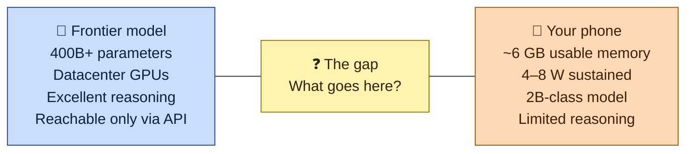
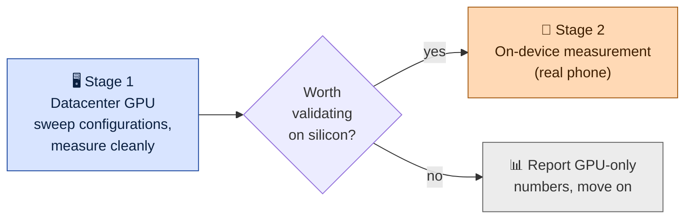
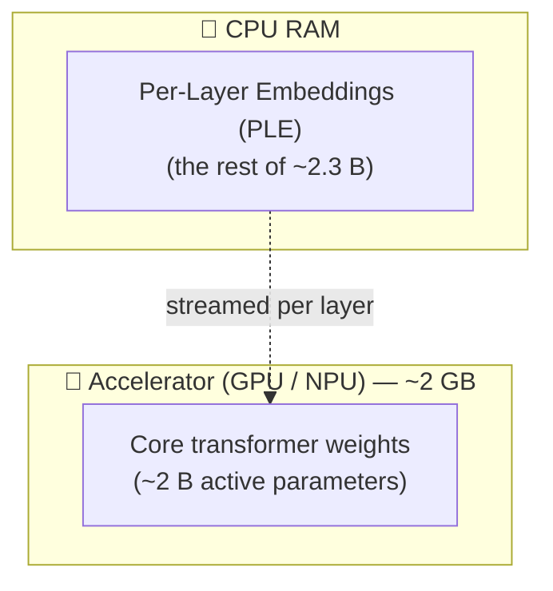
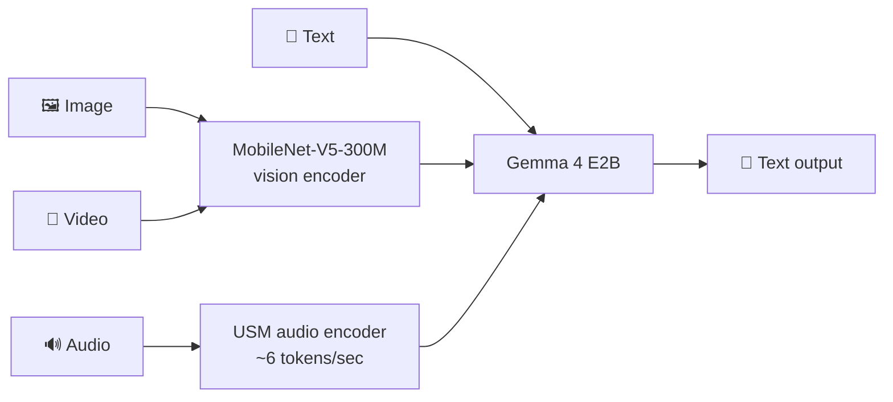
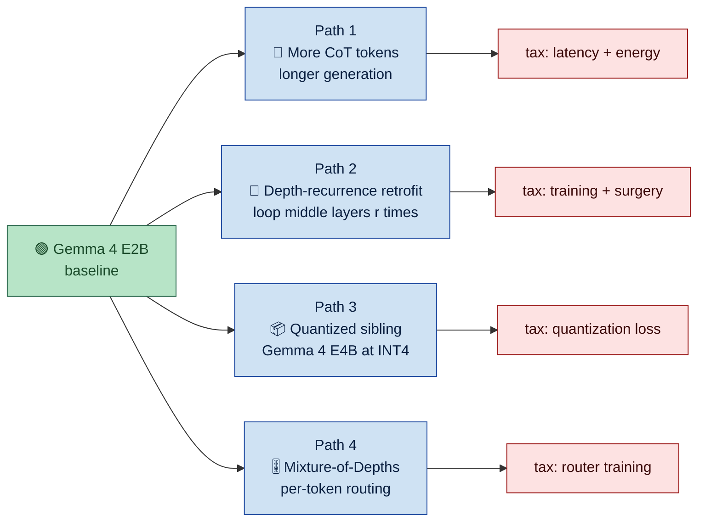
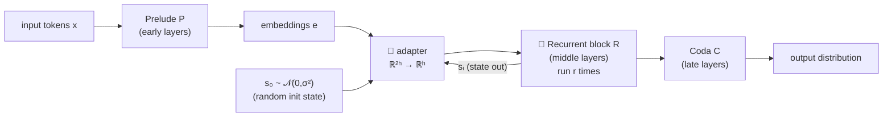
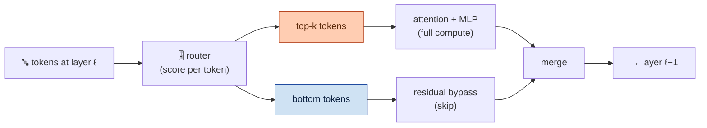
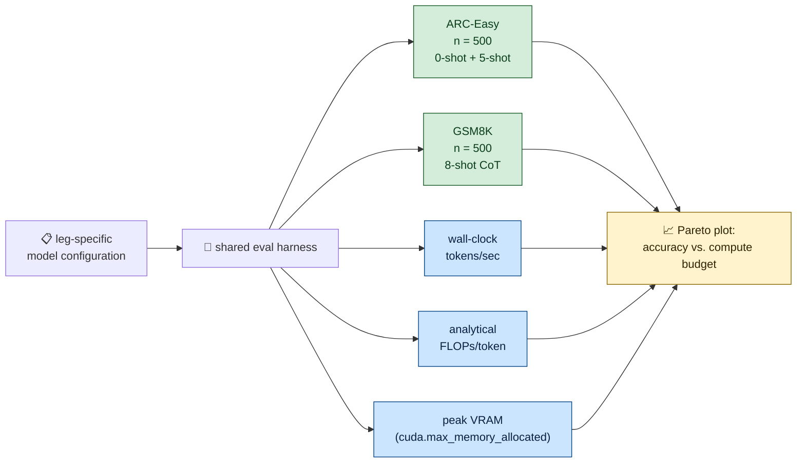
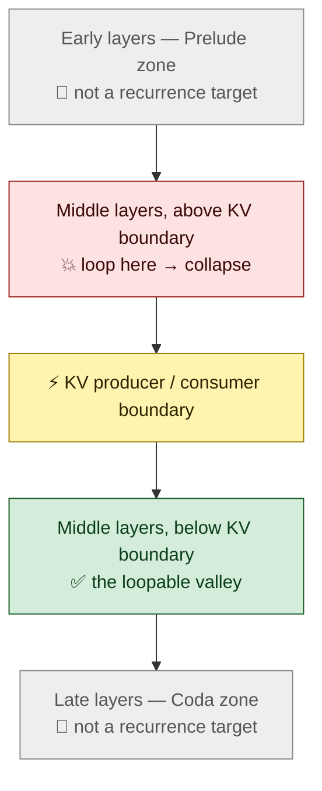

# Paper Banana prompt + source mermaid

**Source:** `papers/four-paths-one-phone-visual-guide.md`
**Target tool:** Paper Banana (illustrated-diagram generator)

---

## Prompt for Paper Banana

> Generate a set of 9 illustrated technical diagrams in a single consistent house style for a blog post titled **"A Visual Guide to Test-Time Compute on a Phone."** The post is a map of four candidate mechanisms for making a 2B-class on-device language model (Gemma 4 E2B) "think harder" under a fixed phone-class compute budget.
>
> **Style requirements (apply to every diagram):**
> - Clean, editorial, hand-illustrated feel — closer to an explainer in *Distill* or *The Pudding* than a PowerPoint flowchart.
> - Warm pastel palette: soft blue for datacenter/GPU/frontier, soft peach/orange for phone/CPU/on-device, muted green for "good / baseline / survivable," muted red for "broken / collapse," pale yellow for boundaries and ambiguity.
> - Label every box in legible sans-serif; keep arrow directionality obvious; avoid clutter.
> - Use simple, recognizable icons (a phone silhouette, a server rack, a brain, a chain loop, a routing switch) instead of generic rectangles where it helps the metaphor.
> - Horizontal layout where the mermaid source is LR; vertical layout where it is TB.
> - Each diagram is standalone and reads left-to-right or top-to-bottom without a legend.
>
> Render the nine diagrams below, preserving labels and arrow semantics exactly. Titles are for your reference; do not draw them inside the diagram unless specified.

---

## Diagram 1 — The gap between frontier and phone (LR)

## Diagram 2 — Two-stage evaluation pipeline (LR)

## Diagram 3 — Gemma 4 E2B with Per-Layer Embeddings (TB)

## Diagram 4 — Multimodal inputs into Gemma 4 E2B (LR)

## Diagram 5 — The four paths and their taxes (LR)

## Diagram 6 — Path 2 depth-recurrence architecture (LR)

## Diagram 7 — Path 4 Mixture-of-Depths router (LR)

## Diagram 8 — Shared measurement rig (LR)

## Diagram 9 — The loopable valley vs. the KV wall (TB)

---

## Per-diagram illustration hints (optional, for Paper Banana)

1. **The gap** — Three-panel strip: server rack ➜ fogged question-mark chasm ➜ phone. Emphasize visual distance between the two ends.
2. **Two-stage pipeline** — A wide GPU block feeding a diamond decision node; the "yes" branch exits to a small phone, the "no" branch exits to a clipboard icon.
3. **PLE architecture** — Stacked card: top card = accelerator (blue) holding transformer layers; bottom card = CPU RAM (peach) holding PLE blocks; dashed arrows showing per-layer streaming between them.
4. **Multimodal inputs** — Four input lanes (text, image, video, audio) converging through their encoders into a central Gemma brain icon, single text output on the right.
5. **Four paths** — Central green baseline node branching into four colored routes, each terminating in a small red "tax" tag. Keep the four routes visually parallel.
6. **Depth-recurrence** — Linear pipeline Prelude → Recurrent block → Coda, with a prominent self-loop around the recurrent block labeled "× r". Small adapter triangle at the block entrance fusing state + embedding.
7. **Mixture-of-Depths** — Tokens entering a router; two streams emerge (hot top-k through full compute, cold through a bypass arc); they reconverge before the next layer.
8. **Measurement rig** — Single funnel (harness) fed by a config card; fans out into two accuracy benchmarks and three compute metrics; all five flow into a Pareto plot thumbnail on the right.
9. **Loopable valley** — Vertical cross-section of the model: greyed prelude and coda zones at the ends, a red "collapse" band above a glowing yellow KV boundary, and a green "valley" band below it.
