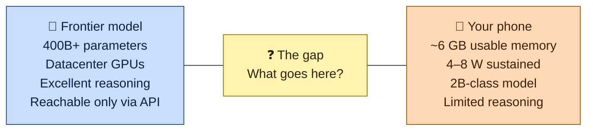
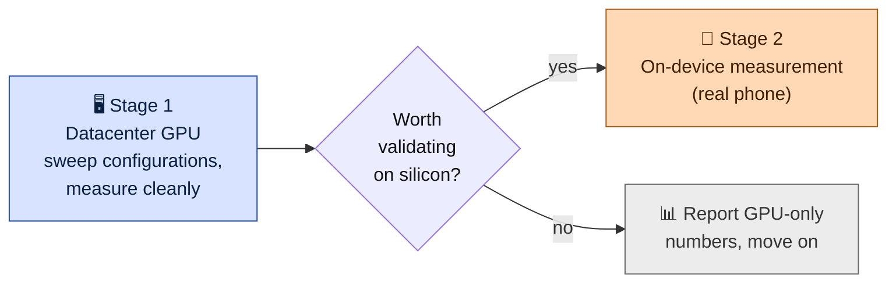
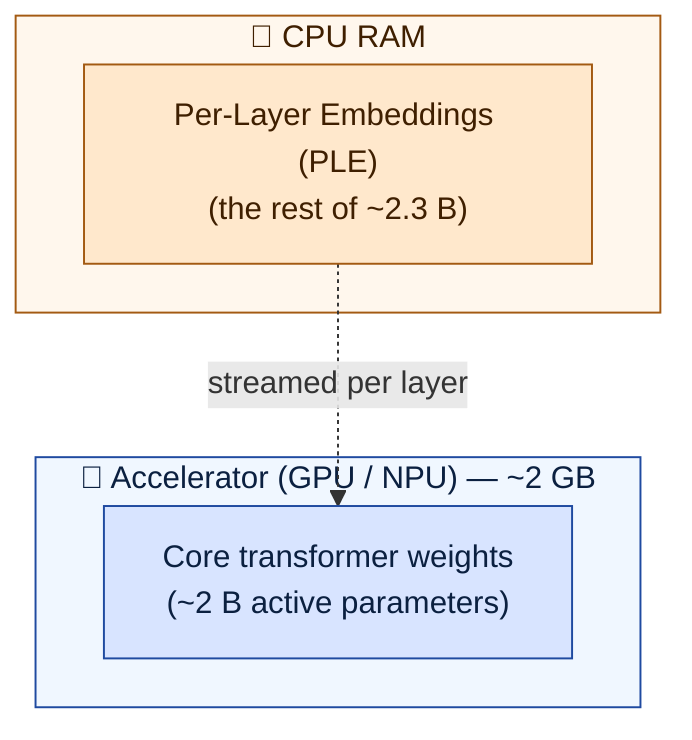
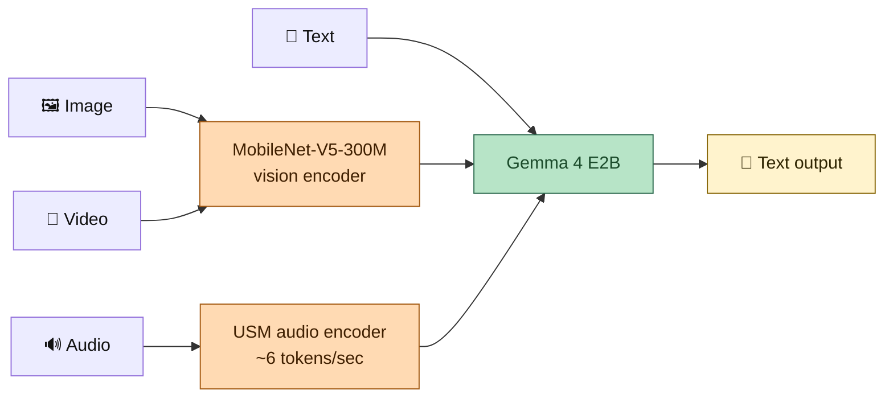
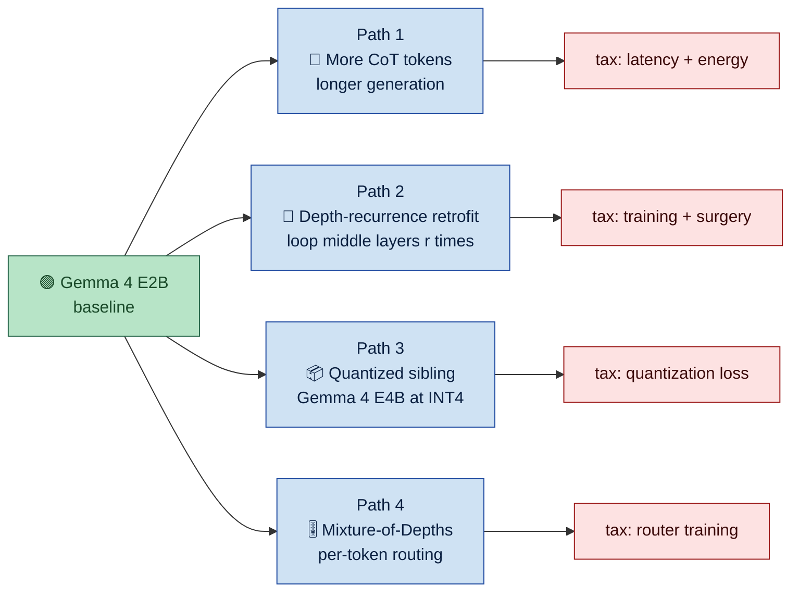
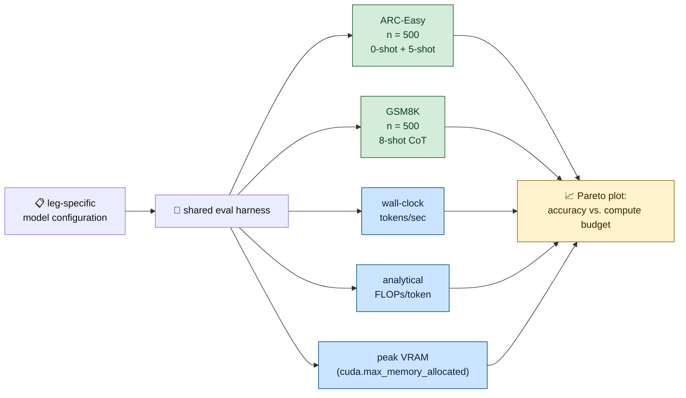
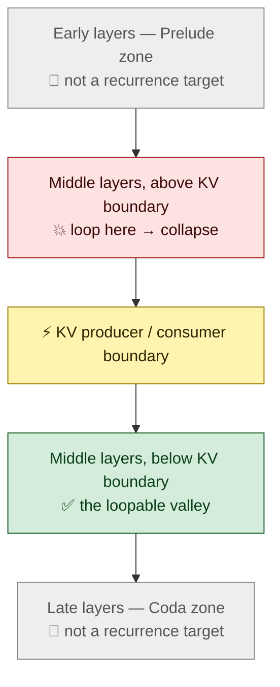

# A Visual Guide to Test-Time Compute on a Phone

*Four ways a small model might think harder, drawn out on Gemma 4 E2B.*

I've been spending the last few months staring at Gemma 4 E2B, trying to answer a question that sounds simple and isn't:

> If the model on your phone can't be *bigger*, can it at least be made to *think harder*?

The frontier models that make you go "oh, it actually understood me" all live in a datacenter. They're 400B-plus parameters; you talk to them through an API. Your phone, meanwhile, has about six usable gigabytes of memory, can sustain four to eight watts without getting uncomfortably hot, and needs to start producing tokens in a few hundred milliseconds or users notice. The good models don't fit, the models that do fit aren't great, and the middle is where all the interesting test-time-compute tricks live.

This post is a map of that middle. It's a visual guide — lots of diagrams — to the four candidate paths I think are worth comparing head-to-head, the baseline I picked to run them on, and how I'm going to measure everything so that the four paths can actually be compared at the end. **No benchmark numbers yet.** Those come as each leg of the work gets written up. What you get here is the shape of the investigation.

Let me start by drawing the gap.



The whole point of this series is filling in that middle box.

---

## The central question

Everything below reduces to one sentence:

> **Given a fixed phone-class compute budget, which test-time-compute-scaling mechanism gives you the most accuracy on reasoning benchmarks?**

Architecture choices, quantization recipes, prompt budgets — they're all in service of answering that.

One meta-decision I should flag up front. The experiments happen in two stages.



Stage one runs entirely on a datacenter GPU. That's where I can sweep configurations cheaply, control the quantization backend, and measure VRAM and tokens/sec without fighting a mobile runtime every time I change a line of code. The phone-class budget is *mapped* onto the GPU measurements, not measured on silicon.

Stage two is conditional. When a GPU configuration shows results that look worth validating on real hardware — typically the survivors of the final head-to-head — I promote it to an on-device measurement. The policy is **"GPU first, phone on demand"**, not *"phone never"*. A configuration whose GPU numbers don't survive mobile deployment is strictly less interesting than one that does, and I want the option of finding that out before I declare a winner.

---

## Why Gemma 4 E2B

Before I pick paths, I have to pick a baseline. There are a lot of 2B-class open models on the shelf right now — Phi, Qwen3-2B, Llama-3.2-1B, a long list. Why Gemma 4 E2B?

Three reasons.

### It fits the phone-class budget by construction

Gemma 4 E2B is engineered for on-device deployment in a way most of its peers aren't. Google reports around **2.3 billion *effective* parameters**, and the model pulls a neat trick to get there: a chunk of the parameters don't live on the accelerator at all.



Per-Layer Embeddings — PLE for short — are exactly what they sound like: embedding-style parameters that live alongside each decoder layer but don't need to sit on the accelerator. They stay in CPU RAM, and each layer's PLE block gets loaded when that layer runs. The end result is an on-device memory footprint of roughly **2 GB** for the E2B variant. Google's LiteRT-LM runtime paired with Qualcomm QNN has been publicly demonstrated running the full multimodal model on mobile SoCs, which is about as close to "this actually works on a phone" as you can get without sending me a benchmark from your own device.

Two gigabytes fits comfortably inside the six-gigabyte envelope I defined above, with headroom for a KV cache, a vision encoder, and — importantly for Path 2 below — the extra depth-recurrence iterations I'm going to ask of it. A 7B-class model does not fit that budget under any realistic quantization, which makes it the wrong size for this investigation, full stop.

### It's natively multimodal, which is what a mobile assistant actually needs

A phone assistant that can't hear the user or see what's on the screen is strictly worse than one that can. Gemma 4 E2B takes all four: text, image, video, and — uniquely to the small E2B / E4B variants, not the bigger Gemma 4 siblings — audio.



The vision encoder is MobileNet-V5-300M, which handles 256×256, 512×512, and 768×768 inputs depending on how much detail you need and at up to 60 frames per second on a Pixel. The audio encoder is USM-based and produces roughly six audio tokens per second, which is fine-grained enough to do speech recognition and speech translation without the model losing the thread of the audio.

For this series that matters in two ways. **First**, the concluding question really is "which mechanism produces the best mobile *assistant*" rather than "which mechanism produces the best tiny text reasoner." Multimodality has to be on the table for the question to mean anything. **Second**, it constrains the surgery: whatever I do to the model to make it reason harder — looping layers, quantizing aggressively, generating more tokens — the vision and audio paths have to keep working. I track "the multimodal adapters still work" as a pass/fail side-constraint, not a scored axis. The benchmarks I've picked are text-only, so a path that silently breaks the vision encoder while preserving text reasoning wouldn't show up in the headline numbers. Something to keep in mind when reading the eventual results.

### The license lets me actually publish what I find

Gemma 4 weights are released under **Apache 2.0**. That means I can fine-tune, retrofit, restructure, and publish — both the resulting weights and the benchmark numbers — without a case-by-case conversation with Google. That includes any depth-recurrence checkpoints I end up training, and any reviewer-requested artifacts from the head-to-head.

The license carries the usual Apache caveats — no warranty, the "Gemma" trademark can't appear in derivative product names — and the copyright of the original training data is a separate matter from the weights themselves. But none of those caveats constrain what this research can ship. That's not a small thing. The alternative — a custom research-only license — would directly limit what the training dry-runs and the final head-to-head could release, and I'd rather flag up front that Apache 2.0 is what makes the output reproducible.

With the baseline pinned, let's look at the four paths.

---

## The four paths, at a glance



Each branch pays a different tax — engineering time, inference latency, memory, or training — in exchange for more accuracy at inference time. They're **not** equivalent swaps: a training-heavy path that needs gradient updates costs very different things than an inference-only path that just generates more tokens. Let me take them one at a time.

### Path 1 — Just generate more tokens

The lowest-surface-area path, and — in hindsight — the one I should have measured first. Don't touch the model at all. Just let it think for longer at inference time: more chain-of-thought, more self-consistency samples, more deliberation prompts.

Zero architectural change. Zero training. The whole tax is paid at inference time, in latency and battery drain per answer. This is the natural baseline every other path on this list has to beat, which is why Leg 1 is what is starting next on the codebase side.

**Tax:** latency, energy, battery.
**Upside:** zero engineering.
**Ceiling:** bounded by what the pretrained weights already encode. There's no mechanism here to spend compute on representations the weights don't carry — you can only re-sample what's already there.

### Path 2 — Loop the middle layers

The most architecturally invasive idea, and the one I've actually been sinking time into so far.

The intuition: a standard transformer passes the hidden state through each layer exactly once. But some of the useful "thinking" a model does is actually iterative — you re-examine a partial answer, update your belief, re-examine again. What if we forced a chunk of middle layers to run multiple times per forward pass?

Here's the shape.

```mermaid
flowchart LR
    X["input tokens x"] --> P["Prelude P<br/>(early layers)"]
    P --> E["embeddings e"]
    E --> A["🔀 adapter<br/>ℝ²ʰ → ℝʰ"]
    S0["s₀ ~ 𝒩(0,σ²)<br/>(random init state)"] --> A
    A --> R["🔁 Recurrent block R<br/>(middle layers)<br/>run r times"]
    R -->|"sᵢ (state out)"| A
    R --> C["Coda C<br/>(late layers)"]
    C --> Y["output distribution"]
    classDef default color:#111

The pretrained model gets split into three pieces — a **Prelude** of early layers that does the initial reading, a **Recurrent block** of middle layers that we iterate, and a **Coda** of late layers that produces the final distribution. A small adapter at the start of the recurrent block takes the previous iteration's state concatenated with the original embedding and compresses them back to the model's normal hidden width. That adapter is how "what I've figured out so far" and "what I originally saw" stay glued together as the loop runs.

More `r` (more loops) means more compute per token, on the **same weights**. The model isn't bigger in memory — it just runs longer.

This idea comes from a November 2025 paper by McLeish et al., *Teaching Pretrained Language Models to Think Deeper with Retrofitted Recurrence*. Their result: a pretrained init plus a careful "recurrence curriculum" gives you a depth-recurrent model that matches or beats its parent on math benchmarks at matched training FLOPs. Encouraging. But their experiments were on TinyLlama, OLMo, and Llama-3.2-1B — all fairly vanilla Llama-style decoders. Gemma 4 E2B is **not** one of those. It has:

- Per-Layer Embeddings (PLE) injected into each decoder layer
- Shared-KV producer/consumer layer pairs
- Sliding-window attention

None of those were tested against the retrofit recipe. Whether the idea transfers is a real empirical question, and most of Leg 2 is me answering that question in the *pretrained-only*, training-free regime, before committing to a training run. Which brings me to the most important thing I've found so far — I'll save the details for §"Early findings from Path 2" below.

**Tax:** high engineering cost, possibly high training cost.
**Upside:** compute scaled *in-place* on the same weights; no extra parameters loaded.

### Path 3 — A bigger sibling, aggressively quantized

Keep the architecture completely stock. Don't retrofit anything. Just swap Gemma 4 E2B for its bigger sibling, **Gemma 4 E4B**, and quantize it hard (INT8, then INT4).

The arithmetic is fun. At INT4, E4B's memory footprint lands in roughly the same VRAM class as E2B at bfloat16 — same storage bucket, roughly twice the parameters, different compute profile. The "larger model in the same budget" trade.

**Tax:** quantization-induced accuracy loss.
**Upside:** access to a strictly more capable parent model.

I want to be honest that this is the scariest path for the overall thesis, because it's a strong baseline that pays no exotic taxes. If Path 3 dominates the head-to-head, the honest conclusion is *"just use the quantized sibling"* and the exotic paths are a curiosity. I'd much rather find that out than wish it away.

### Path 4 — Mixture-of-Depths

Route tokens through variable-depth paths at inference. A learned router per layer scores each token, and only the top-scoring tokens pass through the attention+MLP block for that layer — the rest take a residual bypass and skip.

```mermaid
flowchart LR
    T["🔤 tokens at layer ℓ"] --> R["🎚️ router<br/>(score per token)"]
    R --> TK["top-k tokens"]:::hot
    R --> BP["bottom tokens"]:::cold
    TK --> AM["attention + MLP<br/>(full compute)"]
    BP --> SK["residual bypass<br/>(skip)"]
    AM --> M["merge"]
    SK --> M
    M --> NX["→ layer ℓ+1"]
    classDef hot fill:#ffcdb2,stroke:#b7451f,color:#5c2a0b
    classDef cold fill:#cfe2f3,stroke:#1f4aa0,color:#0b2040
    classDef default color:#111
```

Hard tokens get the full compute. Easy tokens get waved through. It's per-token compute allocation rather than per-layer recurrence.

**Tax:** the router has to be trained end-to-end, even if the rest of the model is frozen.
**Upside:** compute spent where it actually matters, not uniformly.

I'm going to be honest about scope here: Mixture-of-Depths is in this post for completeness, because it's a real mechanism in the space and the map would be incomplete without it. But I'm **descoping it** to "possible future work after the head-to-head concludes." The router-training cost plus the implementation risk doesn't fit into the current shape of the series. Path 4 is on the map; it's not on the itinerary.

---

## How I'm going to measure all four

There's one failure mode that can ruin a project like this before it even gets off the ground: running each path on its own bespoke harness and then trying to compare numbers at the end. I've watched that go wrong too many times. The solution is boring but essential — every leg, without exception, passes through one shared measurement rig.



A few deliberate choices worth flagging:

- **ARC-Easy and GSM8K, not MMLU or HumanEval.** I want benchmarks that actually exercise reasoning, are small enough to run `n=500` cheaply, and have enough headroom on a 2B-class model to be informative. I'll probably add one harder reasoning benchmark (BBH-lite is a candidate) once the rig is stable. That choice gets locked when the rig is finalized, not before.
- **Tokens/sec and VRAM on a single reference GPU.** Different quantization backends have wildly different kernel maturity. Being explicit about which backend each leg uses is the only way to avoid accidentally benchmarking CUDA kernels instead of the idea.
- **Analytical FLOPs/token, not measured.** Profilers are noisy across backends. An analytical count derived from the model config is reproducible anywhere — so that's what I report.
- **Phone-class budget is a mapping, not a measurement.** Per the GPU-first-phone-on-demand policy, most configurations report mapped numbers. Promotion to real-hardware measurement happens selectively.

Leg 2 gets one extra axis: the recurrence count `r`. More `r` means more compute per token, so `r` shows up explicitly on the Pareto plot.

---

## Early findings from Path 2 (depth-recurrence)

An honest note on ordering. Path 1 — longer CoT on the baseline — is the natural first leg of this investigation: simplest, cheapest, and the thing every other path has to beat at matched compute. It is also the leg that is starting next, not the one that started first. In practice I began with Path 2 (depth-recurrence retrofit) because I expected the most surprising findings to come from the most architecturally invasive path. Three of them did, and they reshaped how every other leg now has to be evaluated — including Path 1.

These are **internal observations**, not externally vetted results — the full evidence belongs with the dedicated Leg 2 write-ups still to come. But they're the reason the measurement rig has the shape it does, so they belong in this post.

### Finding 1 — There's a narrow "valley" of loopable layers

If I pick a single middle layer of Gemma 4 E2B and loop it a modest number of times, the model mostly survives — perplexity and accuracy stay close to baseline. If I pick any *other* layer and do the same thing, the model degrades by orders of magnitude. The valley of survivable loop positions isn't where I would have guessed from the architecture diagram.

### Finding 2 — There's a hard wall at the KV producer/consumer boundary

Gemma 4 E2B's shared-KV layers are organized into producer / consumer pairs. If your recurrent block crosses that boundary, everything breaks. If the block is anchored on the consumer side of the boundary, it survives to much larger widths.



Put the valley and the wall together and you get a surprisingly narrow band of the model where depth-recurrence is even *possible*. Outside of that band, the retrofit doesn't fail gracefully — it fails catastrophically.

### Finding 3 — Perplexity stability does **not** imply reasoning stability

This is the finding that bit me hardest and the one I most want you to carry with you into the rest of the series.

Within the set of configurations that preserve perplexity within a small factor of baseline — configurations that a perplexity-only evaluator would green-light — **ARC-Easy accuracy can still collapse.** Worse, the ordering of configurations by perplexity and by downstream reasoning can actually *invert* as the recurrent block widens. Two configurations, `A` and `B`: `A` has better perplexity and worse reasoning; `B` has worse perplexity and better reasoning. A perplexity leaderboard would tell you `A` wins. A reasoning leaderboard tells you `B` wins. Both leaderboards use the same model.

I want you to sit with that for a second.

It means that for **every** path in this series — not just Leg 2 — I have to evaluate on downstream reasoning, not on perplexity. Using perplexity as a proxy would have given me the wrong ranking, confidently. That's why the measurement rig (the diagram two sections up) targets accuracy as the scored axis, not perplexity. If I hadn't probed Path 2 first, I wouldn't have known I needed to.

---

## What this post isn't trying to do

A few disclaimers I'd rather say once than hedge every claim:

- **Not a replication.** The McLeish et al. paper motivates Path 2, but Leg 2 is deliberately evaluated in the pretrained-only, training-free regime for most of the work. "No on-device training budget" is a real constraint for a phone-class deployment target. A training dry-run is planned, but not a full reproduction of the paper's training pipeline.
- **Not an on-device deployment study, by default.** The per-leg compute numbers come from a reference GPU and are mapped to the phone-class budget. Real-hardware runs are promoted selectively, per the GPU-first policy.
- **Not a survey.** Each path gets one well-chosen representative. There's no attempt to enumerate every quantization stack or every CoT prompting trick.
- **Not a win declaration.** I genuinely don't know which path is going to come out on top, and *"the quantized sibling dominates"* is a plausible outcome I'd find less narratively exciting and still have to report honestly.

There are also some real limitations I want to flag up front, not in a footnote at the end:

- The benchmarks have **ceilings**. ARC-Easy tops out around 90% on decent 2B chat models; GSM8K is prompt-sensitive. That's why I'm planning to add a harder reasoning benchmark once the rig is stable.
- The **multimodal paths aren't scored.** They're a pass/fail side-constraint. A path that quietly degrades the vision encoder while preserving text reasoning wouldn't show up in the headline accuracy numbers.
- **Leg 3 depends on Gemma 4 E4B** being available on the Hub under the same terms as E2B. I should pin the commit SHA before that leg starts, not during.
- **Research completion risk is real.** A multi-leg programme that still requires new experiments for Legs 1 and 3 and the head-to-head can stall. I'd rather flag it than silently hope.

---

## The shape of the rest of the research

Leg 2 has preliminary evidence in hand. Leg 1 is starting next. The rest needs new experiments. Here's the rough shape:

| Leg | What's being measured | Where it stands |
|---|---|---|
| **Leg 1 — More CoT tokens** | How accuracy tracks with longer generation, self-consistency, and deliberation prompts on baseline E2B | new experiments required; starting next |
| **Leg 2 — Depth-recurrence retrofit** | Probing the loopable band; testing whether perplexity stability predicts reasoning stability; closing with a width sweep, PLE ablation, and an adapter dry-run | partial evidence in hand |
| **Leg 3 — Quantized sibling** | Gemma 4 E4B at INT8 and INT4 inside the same VRAM envelope as E2B | new experiments required |
| **Head-to-head** | All three on the shared rig at matched compute; GPU survivors promoted to on-device measurement | requires all three legs first |

Mixture-of-Depths stays as potential future work once the head-to-head concludes. I'll write up each piece as the research happens and produces results worth reporting — no pre-committed post schedule. The work decides the pace.

---

## Wrapping up

Test-time compute on a phone is a **constrained optimization**: a fixed memory, power, and latency budget on one side, reasoning accuracy on the other. Four mechanisms can plausibly trade compute for accuracy inside that budget — looping layers, generating more tokens, swapping in a quantized bigger sibling, routing compute per token — and they pay genuinely different taxes to do it.

This investigation commits to putting all four through one shared measurement rig and to reporting the head-to-head honestly — even if the honest answer is "just use the quantized sibling" and the exotic paths are a curiosity.

Leg 2 — depth-recurrence — is where the investigation actually started, and the valley, wall, and perplexity/reasoning inversion findings above are the lessons that work has already produced. Leg 1 — more CoT tokens on baseline E2B — is what's starting next, and it's where the first head-to-head-comparable numbers will land. See you when the first numbers are worth showing.

---

## Sources and further reading

- McLeish, Li, Kirchenbauer et al. *Teaching Pretrained Language Models to Think Deeper with Retrofitted Recurrence.* [arXiv:2511.07384](https://arxiv.org/abs/2511.07384) (2025) — the paper that motivates Path 2.
- Dehghani, Gouws, Vinyals, Uszkoreit, Kaiser. *Universal Transformers.* [arXiv:1807.03819](https://arxiv.org/abs/1807.03819) (2018) — the conceptual ancestor of every "loop the layers" idea.
- Giannou, Rajput, Sohn, Lee et al. *Looped Transformers as Programmable Computers.* [arXiv:2301.13196](https://arxiv.org/abs/2301.13196) (2023) — why we should expect depth-recurrence to at least not be wasted compute.
- Raposo, Ritter, Richards, Lillicrap et al. *Mixture-of-Depths: Dynamically allocating compute in transformer-based language models.* [arXiv:2404.02258](https://arxiv.org/abs/2404.02258) (2024) — the Path 4 mechanism.
- Google. [*Gemma 4 model overview*](https://ai.google.dev/gemma/docs/core) — the model card for the baseline.
- Google Developers Blog. [*Introducing Gemma 3n: The developer guide*](https://developers.googleblog.com/en/introducing-gemma-3n-developer-guide/) — background on PLE, MobileNet-V5, and the USM audio encoder.
- MindStudio. [*Gemma 4's Apache 2.0 License: What Commercial Use Really Means*](https://www.mindstudio.ai/blog/gemma-4-apache-2-license-commercial-use) — on the licensing question.
