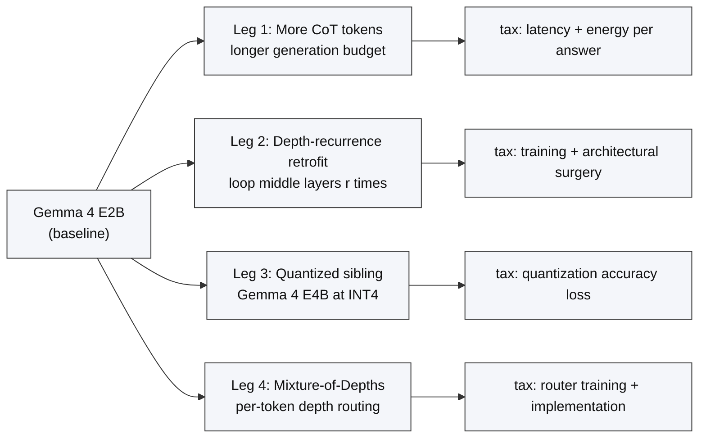
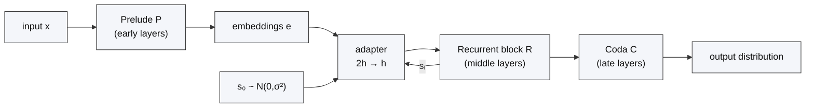
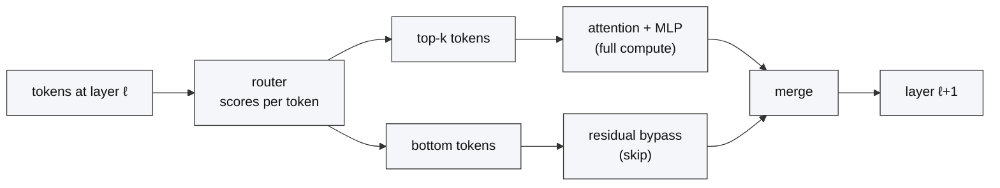
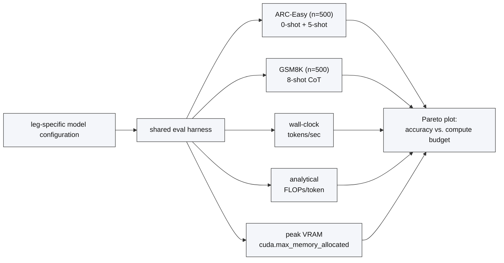

# The On-Device Reasoning Problem: Four Paths, One Phone

**Scaling Test-Time Compute on a Phone: Can Small Models Think Harder?**
*An empirical investigation of four paths on Gemma 4 E2B.*

---

## TL;DR

Large models reason better by being larger. Phones can't run large models. This series asks whether small models can reason *harder* — scaling the compute they spend per query instead of the parameters they hold in memory. We enumerate four candidate paths (more chain-of-thought tokens, depth-recurrence retrofit, a quantized larger sibling, and Mixture-of-Depths), describe the shared measurement rig the rest of the series will use, and explain why we start with the most architecturally invasive path first. **No benchmark numbers appear in this post**; the numbers will land as the research on each leg is conducted against the shared harness described below.

---

## 1. Problem statement

Two empirical observations shape the rest of this series.

- Parameter count is a dominant predictor of reasoning quality in open-weights LLMs across the public benchmark suites. The obvious lever — "make the model bigger" — runs into a hard physical ceiling on a phone: RAM, sustained power, and thermals.
- Test-time compute is a second, less-explored lever. A model that runs the same weights for longer, or through more layers, or under a different precision, can produce different outputs for the same query. Whether that additional compute *translates into additional reasoning* is an empirical question, and the answer depends on which compute-scaling mechanism you pick.

We pin "phone-class" operationally rather than platform-specifically: a target deployment budget of roughly **6 GB of usable model memory, 4–8 W sustained power, and a first-token latency in the hundreds of milliseconds**. The research proceeds in two stages. The first — and by far the largest — stage runs entirely on a datacenter GPU, where we can control the quantization backend, measure VRAM and tokens/sec cleanly, and sweep configurations without rebuilding a mobile runtime for every change; the phone-class budget is reached via VRAM, analytical FLOPs/token, and wall-clock tokens/sec rather than measured on silicon. The second stage is conditional: when a GPU configuration shows a result that looks worth validating on real hardware — typically the survivors of the head-to-head — we promote it to an on-device measurement. The framing is "GPU first, phone on demand", not "phone never": a configuration whose GPU numbers do not survive mobile deployment is strictly less interesting than one that does, and we want the option of finding that out before we declare a winner.

The central question of the series is:

> **Given a fixed phone-class compute budget, which test-time-compute-scaling mechanism delivers the most accuracy on reasoning benchmarks?**

Everything else — architectural surgery, quantization choices, prompting budgets — is in service of that comparison.

---

## 2. Related work

Four lines of prior work frame the four legs.

- **Universal Transformers** (Dehghani et al., 2018, arXiv:1807.03819) introduced weight-tied recurrent transformer depth with a per-token halting mechanism. This is the conceptual ancestor of every "loop the layers" approach.
- **Looped Transformers** (Giannou et al., 2023, arXiv:2301.13196) showed that iterating a transformer block is expressive enough to simulate a programmable computer, giving a theoretical reason to expect that depth-recurrence is at least not wasted compute.
- **Mixture-of-Depths** (Raposo et al., 2024, arXiv:2404.02258) demonstrated that a learned router can spend compute adaptively per token within a transformer stack, trading FLOPs for accuracy at inference time without recurrence.
- **Retrofitting recurrence to pretrained models** (McLeish et al., 2025, arXiv:2511.07384) converts a fixed-depth pretrained decoder into a depth-recurrent one by splitting layers into a Prelude / Recurrent block / Coda and applying the middle block `r` times. This paper motivates Leg 2 specifically; it is not the frame of the series.

Closely related in spirit but evaluated separately: "think-longer" decoding (chain-of-thought scaling, self-consistency), aggressive low-bit quantization stacks (bitsandbytes, AWQ, GPTQ), and test-time iterative refinement methods in the Huginn/process-reward family. The series does not aim to be a comprehensive survey of any of these — it aims to put one well-chosen representative of each mechanism on a shared benchmark.

---

## 3. Why Gemma 4 E2B is the baseline

Three properties of Gemma 4 E2B make it, in our judgment, the right baseline for a phone-class reasoning study today. We state them up-front because every subsequent decision in this series — benchmark choice, quantization recipe, training feasibility — flows from them.

### 3.1 It fits the phone-class budget by construction

Gemma 4 E2B is engineered for the deployment envelope we pinned in §1. Google reports ~2.3 B *effective* parameters, with Per-Layer Embeddings (PLE) offloading a large fraction of embedding parameters to CPU so that only the core transformer weights — on the order of 2 B — need to sit in accelerator memory. Reported on-device memory footprints land around 2 GB for the E2B variant, and Google's LiteRT-LM runtime paired with Qualcomm QNN has been publicly demonstrated running the full multimodal model on mobile SoCs. That sits comfortably inside the ~6 GB usable-memory target from §1, with headroom for a KV cache, a vision encoder, and the additional depth-recurrence iterations Leg 2 will ask of it. A 7 B-class model would not fit that budget under any realistic quantization, which makes it the wrong unit of study for this series.

### 3.2 It is natively multimodal, which is what a phone assistant actually needs

A mobile assistant that cannot hear the user or see their camera is a strictly weaker product than one that can. Gemma 4 E2B accepts text, image, and video — and, as a feature reserved for the small E2B / E4B variants rather than the larger Gemma 4 siblings, audio — via a MobileNet-V5-300M vision encoder and a USM-based audio encoder (≈6 audio tokens per second). For this series that matters in two ways. First, it keeps the concluding question ("which compute-scaling mechanism produces the best mobile *assistant*?") answerable against a model that has the right input surfaces to actually be one, rather than a text-only reasoner retrofitted with a vision head. Second, it constrains the interventions: the depth-recurrence retrofit, CoT budgeting, and quantization recipes must not silently break the vision or audio paths. The series' benchmarks are text-only, so we track "does not break the multimodal adapters" as a pass/fail side-constraint, not a scored axis — and call out the gap in §8.

### 3.3 The Apache 2.0 license makes the derivatives publishable

Gemma 4 weights are released under Apache 2.0. Practically, that means we can retrofit the architecture, fine-tune, and publish the resulting weights and benchmark numbers without a case-by-case conversation with Google — including any depth-recurrence checkpoints Leg 2 eventually trains and any reviewer-requested artifacts from the final head-to-head. The license carries the usual Apache caveats (no warranty; the "Gemma" trademark cannot appear in derivative product names), and the copyright of the original training data is a separate question from the weights license, but none of those caveats constrain a research series. We flag this because the alternative — a custom research-only license — would directly limit what the training dry-run and the head-to-head can actually ship.

---

## 4. The four paths

Figure 1 shows the four mechanisms branching off a single baseline: Google's Gemma 4 E2B. Each branch pays a different tax — engineering, latency, memory, or training cost — to convert that tax into accuracy at inference time.

**Figure 1. The four test-time-compute-scaling paths investigated in this series.** Each branch starts from the same pretrained baseline (Gemma 4 E2B) and ends in a configuration we will benchmark at matched compute budgets. The "primary tax" annotation is qualitative and based on the mechanism, not on measurements — those are the subject of the research this post sets up. *Source: this series' plan document.*

### 4.1 Leg 1 — More chain-of-thought tokens

The lowest-architecture-surface path: run the baseline model with longer generation budgets (more CoT, more deliberation, more self-consistency samples) and see how accuracy tracks. Zero architectural change. The tax is paid entirely at inference time in latency and energy per answer.

Trade-off: zero engineering, no training. Upside bounded by what the pretrained weights already "know"; no mechanism to spend compute on representations the weights don't encode.

### 4.2 Leg 2 — Depth-recurrence retrofit

Re-run a chosen block of middle layers `r` times per forward pass. The baseline model becomes a three-part stack: a Prelude `P` that produces embeddings, a Recurrent block `R` that iterates, and a Coda `C` that decodes.

Formally, following McLeish et al. (2025), for an input sequence `x` and width `h`:

$$
\mathbf{e} = P(x), \qquad
\mathbf{s}_0 \sim \mathcal{N}(0, \sigma^2)^{n \times h}, \qquad
\mathbf{s}_i = R(\mathbf{e}, \mathbf{s}_{i-1}) \text{ for } i \in \{1, \dots, r\}, \qquad
\mathbf{p} = C(\mathbf{s}_r).
$$

The recurrent block begins with a linear adapter `ℝ^{2h} → ℝ^{h}` that takes the concatenation of `s_{i-1}` and `e`. Figure 2 renders the structure.

**Figure 2. The depth-recurrence architecture applied to a pretrained decoder.** The middle block `R` is iterated `r` times; the adapter fuses the previous iteration's state with the original embedding each step. *Redrawn from McLeish et al. (2025), arXiv:2511.07384, §Method.*

The paper's result is that a pretrained initialization plus a recurrence curriculum gives a depth-recurrent model that can match or beat its parent on math benchmarks at matched training FLOPs. That result is for TinyLlama, OLMo, and Llama-3.2-1B — all plain pre-norm Llama-style decoders. Gemma 4 E2B is not: it has Per-Layer Embeddings (PLE) injected into each decoder layer, a shared-KV producer/consumer split, and sliding-window attention. Whether the retrofit transfers is a real empirical question, and most of Leg 2 is about answering it in the pretrained-only regime before committing to training.

Trade-off: high engineering cost, potentially high training cost. Upside: compute scaled *in-place* on the same weights, no extra parameters loaded.

### 4.3 Leg 3 — Run a larger sibling model, quantized

Keep the architecture stock but switch to Google's Gemma 4 E4B and quantize it aggressively (INT8 and INT4 recipes). At INT4, E4B's memory footprint is roughly the same order as E2B at bfloat16 — same VRAM class, twice the parameters, different compute profile.

Trade-off: one-shot quantization step, no training. Upside: access to a strictly more capable parent model, subject to quantization-induced accuracy loss.

This is the scariest leg for the series thesis, because it is a strong baseline that pays no exotic taxes. If it dominates the head-to-head, the honest conclusion is "just use the quantized sibling."

### 4.4 Leg 4 — Mixture-of-Depths

Route tokens through variable-depth paths at inference: a learned router per layer decides which tokens receive the full block and which skip it. Hard tokens get more compute, easy tokens get less. Figure 3 shows the routing pattern at a single layer.

**Figure 3. Mixture-of-Depths token-level routing at one layer.** A router assigns a scalar score per token; the top-k tokens pass through the attention+MLP block, the rest take a residual bypass. The router is trained end-to-end. *Redrawn from Raposo et al. (2024), arXiv:2404.02258.*

Trade-off: the router has to be trained even if the underlying model is frozen. MoD is also descoped in this series — we flag it as a candidate for future work after the head-to-head concludes, rather than committing to a full measurement pass now. See §8 Limitations.

---

## 5. How we'll measure

The single most corrosive failure mode for a series like this is running each leg with a bespoke harness and then trying to compare the numbers at the end. We commit to a shared rig (Figure 4) that every leg must pass through, and the rig will be documented in full before any new measurements run.

**Figure 4. The shared measurement rig every leg reports through.** Accuracy metrics are fixed up-front; compute metrics are measured on a reference GPU and mapped to a phone-class budget analytically. No on-device phone measurements in this series; they are a stretch goal for the final post. *Source: this series' plan, §6 E2.*

A few deliberate choices worth flagging up-front:

- **ARC-Easy and GSM8K, not MMLU or HumanEval.** We want benchmarks that (a) exercise reasoning, (b) are small enough to run `n=500` cheaply, and (c) have enough headroom on a 2B-class model to be informative. We will likely add one harder benchmark (BBH-lite or similar) once the rig is stable; see §8.
- **Tokens/sec and VRAM measured on a single reference GPU.** Different quantization stacks have very different kernel maturity, so we will be explicit about which backend each leg uses.
- **Analytical FLOPs/token, not measured.** Measured FLOPs via profilers are noisy across backends. An analytical count derived from the model config is reproducible across labs.
- **Phone-class budget is a mapping, not a measurement.** We report all numbers on the reference GPU and a mapped number in the phone-class window. Actual on-device measurement is a stretch goal for the final post.

Leg 2 (depth-recurrence) adds one extra axis: the recurrence count `r`. More `r` is more compute per token, so `r` appears explicitly on the Pareto plot.

---

## 6. Early findings from Leg 2

An honest note on ordering: Leg 1 — longer CoT on the baseline — is the natural first leg of this investigation. It is the simplest, cheapest thing on the map and the baseline every other path has to beat. It is also the leg that is starting next, not the one that started first. In practice we began with Leg 2 (depth-recurrence retrofit) because it is the most architecturally invasive path and we expected the most surprising findings to come from there. Three of them did, and they now shape how we evaluate every other leg — including Leg 1. Detailed analysis and numbers follow in dedicated Leg 2 write-ups; the summary here justifies the measurement rig above.

1. **A narrow "valley" of loopable layers.** Naive single-layer looping at modest `r` is survivable in only a narrow band of middle layers of Gemma 4 E2B; most other layers degrade by orders of magnitude. The valley position is not where we would have guessed from the architecture alone.
2. **A hard wall at the KV producer/consumer boundary.** Gemma 4 E2B uses shared-KV layers with a producer/consumer split. Recurrent blocks that cross this boundary break; blocks anchored to the consumer side survive to much larger widths.
3. **Perplexity stability does not imply reasoning stability.** Within the set of configurations that preserve perplexity within a small factor of baseline, ARC-Easy accuracy can still collapse. The ordering of configurations on perplexity and on downstream reasoning can actually *invert* as the block widens. This is the single most consequential finding so far, because it means every leg in this series must be evaluated on downstream reasoning, not on perplexity.

We present these as internal observations, not as external results. The full evidence belongs with the Leg 2 write-ups that will follow. The reason they matter here is that they justify the shape of the measurement rig (Figure 4): if perplexity and reasoning can disagree, accuracy is the only honest target — for every leg, not just Leg 2.

---

## 7. What this series is NOT

A few useful disclaimers up-front:

- **Not a replication.** The McLeish et al. (2025) paper motivates Leg 2, but Leg 2 is deliberately evaluated in the pretrained-only, training-free regime for most of the work, because "no on-device training budget" is a real deployment constraint. A training dry-run is planned but is not a full reproduction of the paper's training pipeline.
- **Not an on-device deployment study by default.** The per-leg compute numbers that drive the head-to-head are reference-GPU measurements mapped to a phone-class budget, not silicon measurements. Configurations that look worth validating on real hardware are promoted to an on-device measurement under the "GPU first, phone on demand" policy (§1), but this series is not structured as a matrix of phone benchmarks.
- **Not a survey.** Each leg picks one representative of its mechanism and measures it well. There is no attempt to enumerate every quantization stack or every CoT prompting trick.
- **Not a win declaration.** We are genuinely uncertain which leg will come out on top at matched budget, and at least one plausible outcome (Leg 3 dominating) is a weaker narrative than the one we would write if we got to pick.

---

## 8. Limitations

Known weaknesses of the series as planned.

- **Benchmark ceiling.** ARC-Easy tops out around 90% on small chat models; GSM8K on 2B-class models is heavily prompt-sensitive. Both have headroom issues. We plan to add one harder reasoning benchmark at the measurement-rig stage; the choice is open and will be locked when the rig is finalized.
- **Multimodal paths are not evaluated.** Gemma 4 E2B's vision and audio encoders are part of the reason it is the right baseline for a phone-class assistant (§3.2), but none of our benchmarks exercise them. We track "does not break the multimodal adapters" as a pass/fail side-constraint, not a scored axis, which means a leg that silently degrades vision or audio performance while preserving text reasoning would not show up in our numbers.
- **Phone-class is hand-wavy for most of the matrix.** We define it operationally (≈6 GB, 4–8 W), and per §1 most configurations are not measured on real hardware. We promote specific configurations to on-device measurement when GPU results warrant it, but this promotion is selective — a configuration that loses on the GPU is not rescued by a phone run, and a configuration that wins on the GPU is not automatically verified on-device.
- **E4B access risk.** Leg 3 depends on Gemma 4 E4B being available on Hugging Face Hub under the same terms as E2B. This should be confirmed and the commit SHA pinned before Leg 3 starts. Flagged here so we cannot pretend later that we didn't know.
- **MoD is descoped.** Leg 4 is mentioned as a mechanism in §4 and in Figure 1 for completeness, but the full MoD implementation is not committed as a series post. It is "future work" unless the rest of the series leaves room.
- **Qualitative Leg 2 findings in this post are not yet externally vetted.** This post does not carry the full numerical evidence — that belongs with the Leg 2 write-ups still to come — and should not be read as making load-bearing numerical claims.
- **Research-completion risk.** A multi-leg research programme that still requires new experiments for Legs 1 and 3 and the head-to-head can stall. We flag this as a real risk of the commitment rather than silently hoping.

---

## 9. Roadmap

The planned research programme. Leg 2 has preliminary evidence in hand; the remaining legs need new experiments. Leg 1 is starting next. We will write up each piece as the research is conducted and produces results worth reporting.

| Leg | Focus | Status |
|---|---|---|
| Leg 1 — More chain-of-thought tokens | How accuracy on the shared benchmarks tracks with longer generation budgets, self-consistency, and deliberation prompts on the baseline E2B | new experiments required; starting next |
| Leg 2 — Depth-recurrence retrofit | Probing Gemma 4 E2B with loops; identifying the loopable band of layers; testing whether perplexity stability implies reasoning stability; closing with a width sweep, PLE ablation, and adapter dry-run | partial evidence in hand; remaining experiments identified |
| Leg 3 — Quantized sibling | Gemma 4 E4B at INT8 and INT4 under the same VRAM envelope as E2B | new experiments required |
| Head-to-head | All legs on the shared rig at matched compute; promote GPU survivors to on-device measurement per §1 | requires all three legs to land first |

MoD (Leg 4) is not in the current commitment; it remains potential future work once the head-to-head concludes.

---

## 10. Conclusion

Test-time compute on a phone is a constrained optimization: a fixed memory, power, and latency budget against reasoning accuracy. Four mechanisms plausibly trade compute for accuracy inside that budget, and they have materially different taxes. This series commits to putting all four through one shared measurement rig and reporting the head-to-head honestly — even if the head-to-head concludes that a quantized 4B sibling at INT4 is the right answer and the exotic paths are not.

Leg 2 — depth-recurrence — is where the investigation began in practice, and the valley, wall, and perplexity/reasoning inversion findings above are the lessons that work has already produced. Leg 1 — more CoT tokens on baseline E2B — is what is starting next, and it is where the first head-to-head-comparable numbers will land. Both will be reported as they come in.

---

## Sources

- McLeish, Li, Kirchenbauer, Kalra, Bartoldson, Kailkhura, Schwarzschild, Geiping, Goldstein, Goldblum. *Teaching Pretrained Language Models to Think Deeper with Retrofitted Recurrence.* arXiv:2511.07384 (2025). https://arxiv.org/abs/2511.07384
- Dehghani, Gouws, Vinyals, Uszkoreit, Kaiser. *Universal Transformers.* arXiv:1807.03819 (2018). https://arxiv.org/abs/1807.03819
- Giannou, Rajput, Sohn, Lee, Lee, Papailiopoulos. *Looped Transformers as Programmable Computers.* arXiv:2301.13196 (2023). https://arxiv.org/abs/2301.13196
- Raposo, Ritter, Richards, Lillicrap, Humphreys, Santoro. *Mixture-of-Depths: Dynamically allocating compute in transformer-based language models.* arXiv:2404.02258 (2024). https://arxiv.org/abs/2404.02258
- Google. *Gemma 4 model overview.* Google AI for Developers (2026). https://ai.google.dev/gemma/docs/core
- Google Developers Blog. *Introducing Gemma 3n: The developer guide.* (2025). https://developers.googleblog.com/en/introducing-gemma-3n-developer-guide/ — background on PLE, MobileNet-V5, and the USM-based audio encoder that Gemma 4 E2B inherits.
- MindStudio. *Gemma 4's Apache 2.0 License: What Commercial Use Really Means.* (2026). https://www.mindstudio.ai/blog/gemma-4-apache-2-license-commercial-use
- Series plan document (internal): `outputs/gemma-recursive-retrofit-blog-plan.md`.
- Leg 2 internal evidence dossier and round summaries (internal): `docs/00_paper_summary.md` through `docs/10_synthesis_and_open_questions.md`; plans and results under `plans/path_2_depth_recurrence/` and `results/path_2_depth_recurrence/`.
